# HRM SaaS Solution – Technical Document (Angular 20 + ASP.NET Core 10 + PostgreSQL)

> **Version:** 4.0 (Multi-Tenant SaaS)
> **Status:** Draft for Review
> **Audience:** Architects, Developers, QA, DevOps, Product, Stakeholders
> **Reference UI:** [OrangeHRM](https://orangehrm.com/) · [Demo](https://opensource-demo.orangehrmlive.com/)

---

## Table of Contents

1. [Overview](#1-overview)
2. [Glossary & Acronyms](#2-glossary--acronyms)
3. [Scope & Out of Scope](#3-scope--out-of-scope)
4. [Stakeholders & User Personas](#4-stakeholders--user-personas)
5. [Functional Requirements](#5-functional-requirements)
6. [Non-Functional Requirements](#6-non-functional-requirements)
7. [Technology Stack](#7-technology-stack)
8. [System Architecture](#8-system-architecture)
9. [Multi-Tenancy Architecture](#9-multi-tenancy-architecture)
10. [Solution Structure (Folder Layout)](#10-solution-structure-folder-layout)
11. [Functional Modules – Detailed](#11-functional-modules--detailed)
12. [ER Diagram](#12-er-diagram)
13. [Class Diagram](#13-class-diagram)
14. [Use Case Diagram](#14-use-case-diagram)
15. [Sequence Diagrams](#15-sequence-diagrams)
16. [Activity Diagrams](#16-activity-diagrams)
17. [Component Diagram](#17-component-diagram)
18. [Deployment Diagram](#18-deployment-diagram)
19. [Database Design](#19-database-design)
20. [API Standards & Conventions](#20-api-standards--conventions)
21. [Key API Endpoints](#21-key-api-endpoints)
22. [Authentication & Social Login](#22-authentication--social-login)
23. [Security & Authorization](#23-security--authorization)
24. [Audit Logging & Compliance](#24-audit-logging--compliance)
25. [Notification System](#25-notification-system)
26. [File & Document Management](#26-file--document-management)
27. [Caching Strategy](#27-caching-strategy)
28. [Background Jobs & Scheduling](#28-background-jobs--scheduling)
29. [Real-time Features (SignalR)](#29-real-time-features-signalr)
30. [Search Strategy](#30-search-strategy)
31. [Internationalization & Localization](#31-internationalization--localization)
32. [Accessibility (a11y)](#32-accessibility-a11y)
33. [Reporting & Analytics](#33-reporting--analytics)
34. [Approval Workflow Engine](#34-approval-workflow-engine)
35. [Admin Console (System + Tenant)](#35-admin-console-system--tenant)
36. [Tenant Lifecycle & Onboarding](#36-tenant-lifecycle--onboarding)
37. [Logging, Monitoring & Observability](#37-logging-monitoring--observability)
38. [Error Handling Strategy](#38-error-handling-strategy)
39. [Testing Strategy](#39-testing-strategy)
40. [Performance & Scalability](#40-performance--scalability)
41. [Backup & Disaster Recovery](#41-backup--disaster-recovery)
42. [Deployment & Environments](#42-deployment--environments)
43. [CI/CD Pipeline](#43-cicd-pipeline)
44. [Coding Standards & Git Workflow](#44-coding-standards--git-workflow)
45. [Risks & Mitigations](#45-risks--mitigations)
46. [Future Enhancements / Roadmap](#46-future-enhancements--roadmap)
47. [Appendix](#47-appendix)

---

## 1. Overview

### 1.1 Project Name
**HRM SaaS Solution**

### 1.2 Purpose
A multi-tenant SaaS Human Resource Management platform delivering employee-lifecycle management — hiring, onboarding, attendance, leave, payroll, performance, training, benefits, offboarding — plus organization-wide reporting, configurable workflows, and self-service portals. Each customer organization ("tenant") gets its own isolated workspace accessed via a unique subdomain (`acme.yourhrm.com`).

### 1.3 Objectives
- Operate one platform that serves many tenant organizations from a shared infrastructure with strict data isolation.
- Replace customers' manual / spreadsheet HR processes with a unified digital workflow.
- Provide employee self-service for leave, attendance, payslips, and personal information.
- Give managers approval queues and team dashboards.
- Give HR a single source of truth for headcount, compensation, performance, and compliance.
- Provide configurable workflows so the system adapts to each tenant's policy rather than forcing them to ours.
- Provide a system admin console for the operator team to provision, monitor, and support tenants.

### 1.4 Success Criteria
| # | Criterion | Target |
|---|----------|--------|
| 1 | Employee self-service adoption (per tenant) | ≥ 90% of active employees use the portal monthly |
| 2 | Leave processing time | ≤ 24 hours from request to decision (average) |
| 3 | Payroll run time | Full payroll for 5,000 employees in < 10 minutes |
| 4 | Platform availability | ≥ 99.5% monthly, measured per tenant |
| 5 | Page-load P95 (authenticated pages) | ≤ 2.5 seconds |
| 6 | Bug-escape rate to production | < 5 critical bugs per release |
| 7 | Cross-tenant data leak incidents | 0 (zero tolerance) |
| 8 | Tenant provisioning time | < 5 minutes (manual) / < 60 seconds (self-serve, future) |

### 1.5 Reference UI Inspiration
OrangeHRM (orangehrm.com) for module layout, terminology, and self-service patterns. Implementation is independent and proprietary.

---

## 2. Glossary & Acronyms

| Term | Definition |
|------|------------|
| HRM | Human Resource Management |
| SaaS | Software as a Service |
| Tenant | A customer organization with an isolated workspace on the platform |
| System Admin | The platform operator's own staff with cross-tenant administrative privileges |
| Tenant Admin | A user within a tenant with administrative privileges scoped to that tenant only |
| RLS | Row-Level Security (PostgreSQL feature for row-based access policies) |
| SPA | Single Page Application |
| API | Application Programming Interface |
| JWT | JSON Web Token |
| OIDC | OpenID Connect |
| SAML | Security Assertion Markup Language |
| SSO | Single Sign-On |
| MFA | Multi-Factor Authentication |
| SCIM | System for Cross-domain Identity Management (user provisioning standard) |
| RBAC | Role-Based Access Control |
| ABAC | Attribute-Based Access Control |
| DTO | Data Transfer Object |
| EF Core | Entity Framework Core |
| 3NF | Third Normal Form |
| KPI | Key Performance Indicator |
| LOP | Loss of Pay |
| CTC | Cost to Company |
| ESS | Employee Self-Service |
| MSS | Manager Self-Service |
| OWASP | Open Worldwide Application Security Project |
| SLA | Service Level Agreement |
| RTO | Recovery Time Objective |
| RPO | Recovery Point Objective |
| PII | Personally Identifiable Information |
| GDPR | General Data Protection Regulation |
| i18n | Internationalization |
| a11y | Accessibility |
| MRR | Monthly Recurring Revenue |
| ARR | Annual Recurring Revenue |
| ARPU | Average Revenue Per User |
| LTV | Lifetime Value |
| CI/CD | Continuous Integration / Continuous Deployment |
| BFF | Backend For Frontend |
| PITR | Point-In-Time Recovery |

---

## 3. Scope & Out of Scope

### 3.1 In Scope (Phase 1)
**Multi-tenancy foundation**
- Shared-database, shared-schema multi-tenancy with `tenant_id` discriminator on every business table
- PostgreSQL Row-Level Security (RLS) policies as defense-in-depth
- Subdomain-based tenant resolution (`{tenant}.yourhrm.com`)
- Global user identity (one user, many tenant memberships) with per-membership role assignments
- Manual tenant provisioning via System Admin console (self-serve signup deferred)

**Authentication**
- Local username + password
- Sign in with Microsoft (work accounts via Microsoft Entra ID + consumer accounts)
- Sign in with Google
- Sign in with Apple
- JWT access tokens + refresh tokens
- MFA (TOTP), optional per tenant policy

**HRM modules** (per tenant)
- Core HR (employees, departments, job titles, organization tree)
- Leave management (types, balances, requests, approvals, holiday calendar)
- Attendance (clock-in/out, shifts, overtime, regularization)
- Recruitment (vacancies, applicants, interviews, offers)
- Payroll (salary structures, components, runs, payslips, statutory deductions)
- Performance (KPI, goals, appraisal cycles, optional 360°)
- Benefits & allowances
- Reports & analytics
- Notifications (email + in-app)
- Audit logging
- Role-based access control per tenant
- Employee self-service portal

**Admin Consoles**
- System Admin (cross-tenant operations)
- Tenant Admin (per-tenant configuration)

**Internationalization**
- English + one secondary language out of the box; framework supports more

### 3.2 Out of Scope (Phase 1)
- Self-serve signup with automated billing & payment (tenants provisioned manually; billing handled offline initially)
- SAML / SCIM enterprise SSO (architecture-ready but not built; targeted Phase 2)
- Custom domains (`hr.acme-corp.com`) — subdomains only in Phase 1
- Native mobile apps (web is responsive; native deferred)
- Biometric hardware integration
- Country-specific statutory tax engines beyond one configured country
- AI-based resume screening
- Multi-region data residency (single region in Phase 1)
- White-label / "remove operator branding" feature
- Marketplace integrations (Slack, Teams, etc.)
- Custom report builder (drag-and-drop)
- Sandbox / staging environment per tenant

### 3.3 Assumptions
- Modern browsers only (latest 2 versions of Chrome, Edge, Firefox, Safari)
- Wildcard DNS + wildcard TLS certificate available for subdomain hosting
- An Apple Developer Program subscription is acquired before "Sign in with Apple" is enabled
- Microsoft and Google developer accounts are set up for OAuth client registration
- SMTP relay or transactional email service available

### 3.4 Constraints
- Budget and timeline as defined in the project charter
- Must support GDPR data subject rights from day one
- Cross-tenant data leak is a zero-tolerance incident category

---

## 4. Stakeholders & User Personas

### 4.1 Stakeholders
| Stakeholder | Interest |
|------------|----------|
| Platform Owner (you) | Customer acquisition, ARR, retention, operational efficiency |
| Engineering & DevOps | Reliability, security, maintainability, ability to scale tenants |
| Customer Success | Smooth onboarding, low support volume per tenant |
| Tenant Executive | ROI, compliance, headcount visibility |
| Tenant HR | Process efficiency, configuration flexibility, reporting |
| Tenant Finance | Payroll accuracy, audit trail, invoice clarity |
| Tenant Employees | Easy self-service, transparency |
| Tenant Managers | Approval workflow, team visibility |

### 4.2 Personas

**System Admin (Platform Operator Staff)**
- Provisions new tenants, monitors platform health, supports tenant admins, manages plans, handles billing operations, investigates incidents. Acts across all tenants. Sees aggregate analytics.

**System Support (Platform Operator Staff)**
- Subset of System Admin role — limited to read-only views and impersonation for support cases, no destructive operations.

**Tenant Owner**
- The customer's primary contact / first admin user. Owns the subscription, controls billing, can transfer ownership. Has full tenant-admin privileges plus subscription rights.

**Tenant Admin**
- The customer's IT/HR admin. Configures master data, users, roles, workflows, modules. Cannot see billing details unless also Tenant Owner.

**HR Officer (tenant role)**
- Day-to-day HR operations: onboarding, employee records, payroll runs, recruitment pipeline, reports.

**Manager (tenant role)**
- Approves leave/attendance for their team, conducts appraisals, views team dashboards.

**Employee (tenant role)**
- Applies for leave, clocks in/out, views payslips, updates personal info, applies to internal vacancies.

**Recruiter (tenant role)**
- Manages vacancies, applicants, interview schedules, offer letters.

**Auditor (tenant role, read-only)**
- Views logs and reports without ability to modify data.

**Cross-Tenant User**
- One person (one email identity) who belongs to multiple tenants — e.g., a payroll vendor, audit firm, parent-company admin, or contractor working with several customers. Each membership has its own role set.

---

## 5. Functional Requirements

### 5.1 Modules at a Glance
| Module | Description | Scope |
|--------|-------------|-------|
| **Platform — System Admin** | Tenant lifecycle, plans, monitoring, billing operations | System |
| **Platform — Tenant Admin** | Per-tenant configuration, users, roles, workflows | Per tenant |
| Core HR | Employees, Departments, Job Titles, Org tree, Locations | Per tenant |
| Leave | Leave types, balances, requests, approvals, holiday calendar | Per tenant |
| Attendance | Clock-in/out, shifts, overtime, regularization | Per tenant |
| Recruitment | Vacancies, applicants, interviews, offers | Per tenant |
| Onboarding / Offboarding | Joining checklist, asset issue, clearance, exit interview | Per tenant |
| Payroll | Salary structures, components, runs, payslips, statutory | Per tenant |
| Performance | KPIs, goals, appraisal cycles, feedback | Per tenant |
| Training | Courses, sessions, attendance, certifications (lite) | Per tenant |
| Benefits | Insurance, allowances, reimbursements | Per tenant |
| Asset Management | Issuance, returns, asset register (lite) | Per tenant |
| Reports & Analytics | Pre-built reports, exports | Per tenant + cross-tenant (system) |
| Notifications | Email + in-app | Per tenant templates |
| Audit | Immutable audit trail | Per tenant + system-level |
| Settings | Org config, workflows, master data | Per tenant + system-level |

### 5.2 Sample User Stories

**Multi-tenancy & onboarding**
- *As a Platform Owner*, I want to provision a new tenant with a subdomain, primary admin user, and starter plan within minutes, so that I can onboard customers quickly.
- *As a System Admin*, I want to impersonate a tenant admin (with audit) to investigate issues without asking for their credentials.
- *As a Cross-Tenant User*, I want to switch between the tenants I belong to without re-authenticating, so I can manage multiple clients smoothly.

**Authentication**
- *As a user*, I want to sign in with my work Microsoft account, so I don't need a new password.
- *As a tenant admin*, I want to restrict Google sign-in to my company's email domain only, so external Gmail accounts cannot enroll.
- *As a tenant admin*, I want to require MFA for users in administrative roles, so privileged access is hardened.

**Leave**
- *As an employee*, I want to apply for leave by selecting a leave type, dates, and reason, so my manager can approve it.
- *As a manager*, I want a queue of pending leave requests with employee leave balance shown inline, so I can decide quickly.
- *As an HR officer*, I want to configure leave types and yearly entitlements, so policy is enforced automatically.

**Attendance**
- *As an employee*, I want to clock in/out from my browser (with optional geolocation), so my hours are tracked accurately.
- *As an employee*, I want to request regularization when I forget to clock in/out, with a reason, for manager approval.
- *As HR*, I want a monthly attendance summary per employee with late/overtime/absent counts feeding into payroll.

**Recruitment**
- *As a recruiter*, I want to publish a vacancy, accept applications, and move applicants through pipeline stages.
- *As an applicant*, I want to upload my résumé and track my application status.
- *As an interviewer*, I want to submit a structured interview score and notes.

**Payroll**
- *As HR*, I want to run payroll for a month, generate payslips, and email them to employees.
- *As an employee*, I want to download my payslips for any month I've worked.

**Performance**
- *As a manager*, I want to set goals/KPIs for my team members at the start of a cycle.
- *As an employee*, I want to self-rate against my goals before my manager rates me.
- *As HR*, I want to run a 360° review where peers, reports, manager, and self all provide input.

---

## 6. Non-Functional Requirements

### 6.1 Tenant Isolation (Hard Requirement)
- **Zero cross-tenant data leakage.** Every query, cache key, file path, log line, and background job carries a tenant context that is enforced at multiple layers (EF Core filter + PostgreSQL RLS + integration tests).
- A request without a valid tenant context (where a tenant context is expected) must be rejected, not assumed.
- Tenant isolation tests run on every PR; failures block merge.

### 6.2 Performance
| Metric | Target |
|--------|--------|
| API response P95 (read) | ≤ 400 ms |
| API response P95 (write) | ≤ 800 ms |
| Page Time-to-Interactive P95 | ≤ 2.5 s on 4G |
| Payroll run for 5,000 employees | ≤ 10 minutes |
| Concurrent users supported (platform-wide) | ≥ 10,000 |
| Bulk import (10k rows) | ≤ 5 minutes |
| Tenant resolution overhead | ≤ 5 ms (cached) |

### 6.3 Scalability
- Horizontal scaling of API behind a load balancer; stateless instances.
- Database scale-up first; read replicas for reports; partitioning by tenant-id range for very large tables in Phase 2 if needed.
- Background workers scale independently from API.
- Architecture must accommodate database-per-tenant for enterprise tier later without rewrite.

### 6.4 Availability
- Target ≥ 99.5% monthly uptime per tenant.
- Graceful degradation: tenant in `past_due` or `suspended` state surfaces an appropriate banner instead of breaking.

### 6.5 Security
- OWASP Top 10 controls in place.
- All traffic over HTTPS (TLS 1.2+).
- Secrets in Key Vault / Secrets Manager (no secrets in source or `appsettings.json`).
- Encryption at rest (managed-service storage encryption + `pgcrypto` for sensitive PII columns) and in transit.
- Cross-tenant access requires explicit System Admin permission and is fully audited (including impersonation).

### 6.6 Maintainability
- Clean Architecture, SOLID.
- ≥ 70% unit-test coverage on Application + Domain layers; ≥ 85% on critical modules (payroll, leave calculation, tenant isolation).
- Static analysis on every PR.

### 6.7 Usability
- Mobile-responsive (down to 360px).
- WCAG 2.1 AA accessibility.
- Consistent design system across all modules.
- Tenant-branded login & app shell (logo, primary color).

### 6.8 Compatibility
- Browsers: latest 2 versions of Chrome, Edge, Firefox, Safari.
- DB: PostgreSQL 14+.
- .NET 10, Angular 20.

### 6.9 Compliance
- GDPR-aligned: data subject access & erasure (per tenant, per user), 7-year audit retention.
- PII access logged.
- Per-tenant data export on demand.
- Per-tenant data deletion within configurable grace window on tenant termination.

### 6.10 Reliability
- Idempotent write operations on critical endpoints (via `Idempotency-Key` header).
- Optimistic concurrency on shared records (xmin token).

### 6.11 Observability
- Structured logs with `tenant_id`, `trace_id`, `user_id` on every record.
- Per-tenant metrics for SLA reporting.
- Distributed tracing.

### 6.12 Operability
- System Admin can provision a new tenant in ≤ 5 minutes (manual).
- System Admin can suspend or terminate a tenant within a single screen action.
- System Admin can impersonate any tenant user with full audit trail and tenant-admin notification.
- Per-tenant export bundle generatable on demand.

---

## 7. Technology Stack

### 7.1 Frontend
- **Framework:** Angular 20 (standalone components, signals where applicable)
- **Language:** TypeScript (strict mode)
- **Reactive:** RxJS
- **UI Kit:** Angular Material + Tailwind CSS utility classes
- **State Management:** NgRx Signals / NgRx Store (selective)
- **Auth:** JWT via HTTP Interceptor; silent refresh; tenant context resolved from subdomain on app bootstrap
- **i18n:** ngx-translate / Angular built-in i18n
- **Charts:** Chart.js / ngx-charts
- **Forms:** Reactive Forms with custom validators
- **HTTP:** Angular HttpClient with interceptors (auth, tenant, error, loading, retry)
- **Build:** esbuild (Angular CLI), source maps, bundle analyzer
- **PWA:** @angular/pwa for offline shell (optional)
- **Testing:** Jasmine + Karma (unit), Playwright (E2E)

### 7.2 Backend
- **Framework:** ASP.NET Core 10 Web API
- **ORM:** Entity Framework Core 10
- **Mapping:** AutoMapper / Mapster
- **Validation:** FluentValidation
- **Logging:** Serilog (sinks to console, file, Seq / ELK / App Insights)
- **API Docs:** Swagger/OpenAPI (Swashbuckle or NSwag)
- **Identity:** ASP.NET Core Identity (extended for global users + multi-tenant memberships)
- **Auth:** JWT + Refresh Token; first-party OAuth handlers for Google / Microsoft / Apple
- **Social Login Packages:** `Microsoft.AspNetCore.Authentication.Google`, `Microsoft.AspNetCore.Authentication.OpenIdConnect` (for Microsoft Entra), `AspNet.Security.OAuth.Apple` (10.x)
- **Background Jobs:** Hangfire with `Hangfire.PostgreSql` storage
- **Real-time:** SignalR with Redis backplane
- **Mediator:** MediatR for CQRS-style command/query split
- **Resilience:** Polly (retry, circuit-breaker)
- **Testing:** xUnit, FluentAssertions, NSubstitute, Testcontainers for integration

### 7.3 Database
- **Primary:** PostgreSQL 14+ (managed: Azure Database for PostgreSQL / AWS RDS / Aurora / Google Cloud SQL; or self-hosted)
- **Driver / ORM:** `Npgsql` + `Npgsql.EntityFrameworkCore.PostgreSQL` (10.0.x)
- **Naming convention:** `snake_case` via `EFCore.NamingConventions`
- **Migrations:** EF Core Migrations (code-first)
- **Isolation:** Shared database, shared schema; `tenant_id` discriminator + RLS policies
- **Reporting:** PostgreSQL streaming replication for read replicas; PG views for heavy reports
- **Cache:** Redis (sessions, lookup data, computed leave balances, tenant lookup cache, SignalR backplane)
- **PG-specific features leveraged:** `jsonb` for custom fields and audit payloads, `uuid` (UUIDv7) for tenant IDs, native arrays where they fit, full-text search via `tsvector`, RLS for tenant isolation

### 7.4 DevOps / Hosting
- **Containerization:** Docker
- **CI/CD:** GitHub Actions or Azure DevOps Pipelines
- **Hosting:** Azure App Service / AWS ECS / Kubernetes / On-prem
- **Reverse Proxy:** Nginx / Azure Front Door (must support wildcard SNI for tenant subdomains)
- **DNS:** Wildcard DNS record `*.yourhrm.com` → load balancer
- **TLS:** Wildcard certificate (Let's Encrypt with DNS-01 challenge, or commercial)
- **Secrets:** Azure Key Vault / AWS Secrets Manager / HashiCorp Vault
- **Monitoring:** Application Insights / ELK / Grafana + Prometheus
- **APM:** Application Insights / New Relic / Datadog
- **Object Storage:** Azure Blob / AWS S3 / MinIO (tenant-scoped paths)
- **Email:** SMTP relay / SendGrid / Azure Communication Services
- **Payments (Phase 2):** Stripe or Paddle for self-serve billing

---

## 8. System Architecture

### 8.1 High-Level Architecture
- Angular SPA served as static files via CDN/Nginx; one build serves all tenants, branding loaded at runtime from the tenant context endpoint.
- Wildcard DNS routes `{tenant}.yourhrm.com` to the same load balancer; ASP.NET Core middleware resolves the tenant from the host header.
- ASP.NET Core API handles authentication, authorization, tenant resolution, business logic, validation. Stateless and horizontally scalable.
- EF Core (via Npgsql) manages persistence. Global query filters + RLS policies enforce tenant isolation.
- Redis caches reference data (tenant lookup, permissions, computed values) and acts as the SignalR backplane.
- Hangfire workers run scheduled jobs (payroll, reports, notifications), tenant-aware.
- SignalR pushes real-time events to tenant- and user-scoped groups.
- Blob storage holds documents under tenant-scoped paths.

### 8.2 Request Pipeline (Tenant-Aware)
```
[Request] → TLS termination
         → Host header extracted
         → Tenant Resolution Middleware
              · Map subdomain → tenant_id (Redis cache, fallback DB)
              · Reject if tenant unknown / suspended / terminated
              · Populate ITenantContext (scoped service)
         → Authentication Middleware (JWT bearer)
              · Verify tenant_id claim matches resolved tenant
         → Authorization Middleware (policies)
         → Controller / Endpoint
              · EF Core queries automatically scoped by ITenantContext
              · PostgreSQL RLS as second line of defense
         → Response
```

### 8.3 Backend – Clean Architecture
```
┌──────────────────────────────────────────────────────────────┐
│  Presentation Layer (HRM.Api)                                │
│  Controllers · Minimal APIs · Tenant Middleware · Filters    │
└──────────────────────────────────────────────────────────────┘
                            │
┌──────────────────────────────────────────────────────────────┐
│  Application Layer (HRM.Application)                         │
│  Use Cases · DTOs · Validators · ITenantContext · Mappings   │
└──────────────────────────────────────────────────────────────┘
                            │
┌──────────────────────────────────────────────────────────────┐
│  Domain Layer (HRM.Domain)                                   │
│  Entities · Value Objects · Domain Events · Specifications   │
└──────────────────────────────────────────────────────────────┘
                            │
┌──────────────────────────────────────────────────────────────┐
│  Infrastructure Layer (HRM.Infrastructure)                   │
│  EF Core + Tenant Interceptor · Repos · External Services    │
│  RLS Helpers · Cache · Email · Storage · Background Jobs     │
└──────────────────────────────────────────────────────────────┘
```

### 8.4 Frontend – Feature Module Architecture
- Standalone components organized by feature (employees, leave, attendance, payroll, …).
- Shared module(s) for UI primitives, pipes, directives.
- Core module for singleton services (auth, tenant, http, error handler, notification, logging).
- Lazy loading per feature route to keep initial bundle small.
- On app bootstrap: resolve tenant from URL subdomain, fetch tenant branding & enabled modules, render shell.

---

## 9. Multi-Tenancy Architecture

This section consolidates the multi-tenancy design. Other sections reference it.

### 9.1 Isolation Model
**Shared database, shared schema with `tenant_id` discriminator + PostgreSQL Row-Level Security (RLS).**

Justification:
- Operationally cheapest at low-to-mid scale (the right starting point).
- Same migrations for all tenants — one schema to evolve.
- PG RLS provides database-level isolation as defense-in-depth.
- Forward-compatible with database-per-tenant (extracted later as needed).

**Three layers of isolation enforcement** (defense in depth):
1. **Application:** every API request resolves and carries an `ITenantContext`; controllers and services never receive tenant-less query parameters.
2. **EF Core:** global query filters automatically scope all queries to the current tenant.
3. **PostgreSQL RLS:** policies on every business table reject reads/writes whose `tenant_id` does not match the session-level setting `app.current_tenant_id`.

### 9.2 Tenant Resolution
**Subdomain primary.** Wildcard DNS routes `{slug}.yourhrm.com` to the platform. Tenant Resolution Middleware extracts the subdomain, looks it up (Redis cache → DB), and sets `ITenantContext`.

Reserved subdomains (cannot be claimed): `www`, `api`, `admin`, `app`, `mail`, `status`, `docs`, `help`, `support`, `static`, `cdn`, `dev`, `stage`, `prod`, `test`, `qa`.

For system admin: separate subdomain `admin.yourhrm.com` resolves to a "system tenant" context that grants cross-tenant operations to authorized users.

Custom domains (`hr.acme-corp.com`) deferred to Phase 2 — same resolution mechanism plus a `tenant_custom_domain` lookup table.

### 9.3 User Identity Model
**Global users with multi-tenant memberships.**

- `users` table holds the global identity (email is unique platform-wide).
- `user_tenants` junction table records each membership (user × tenant × roles × status).
- A single login session can switch between the user's memberships without re-authenticating; each switch issues a new JWT with the chosen `tenant_id` claim.
- Social login (Google/Microsoft/Apple) authenticates the user globally; the user then enters a specific tenant via subdomain.

Roles are **per-membership**, not per-user. The same person can be `Manager` in tenant A and `Auditor` in tenant B.

### 9.4 Tenant Context Propagation
`ITenantContext` is a scoped DI service populated by middleware:
```csharp
public interface ITenantContext
{
    Guid TenantId { get; }
    string Subdomain { get; }
    TenantStatus Status { get; }
    SubscriptionPlan Plan { get; }
    bool IsSystemContext { get; }
    IReadOnlyCollection<string> EnabledModules { get; }
}
```

Propagation rules:
- **Synchronous code:** injected as a scoped service.
- **EF Core:** an EF interceptor reads `ITenantContext` and applies it as a PG session setting (`SET LOCAL app.current_tenant_id = '...';`) on every command — RLS uses this.
- **Background jobs:** `TenantId` is a required parameter on every job; a Hangfire filter restores `ITenantContext` before the job body runs.
- **SignalR:** clients connect to user-scoped + tenant-scoped groups; messages always include the `tenant_id` claim.
- **Logging:** Serilog enricher adds `tenant_id` to every log record.
- **Cache keys:** every key prefixed with `t:{tenantId}:`.
- **Outbound webhooks / emails:** rendered from per-tenant templates and signed with tenant-scoped key.

### 9.5 Tenant Lifecycle States
```
                     ┌────────┐
                     │ Trial  │  (default on creation; trial_ends_at set)
                     └────┬───┘
                          │ admin pays or extends
                          ▼
                  ┌──────────────┐
   ┌──────────────┤    Active    ├───────────┐
   │              └──────┬───────┘           │
   │ payment             │ system admin      │
   │ fails               │ suspends          │
   ▼                     ▼                   │
┌──────────┐        ┌────────────┐           │
│ PastDue  │───────►│ Suspended  │           │
└──────────┘        └─────┬──────┘           │
                          │ admin terminates │
                          ▼                  │
                  ┌────────────────┐         │
                  │   Terminating  │◄────────┘
                  │ (grace period) │
                  └──────┬─────────┘
                         │ grace expires
                         ▼
                  ┌────────────┐
                  │ Terminated │ (data purged after retention)
                  └────────────┘
```

Behavior per state:
| State | Login | API access | Notes |
|-------|-------|------------|-------|
| `trial` | Allowed | Full | Banner shows days remaining |
| `active` | Allowed | Full | Normal operation |
| `past_due` | Allowed | Read-only after grace | Daily reminders to billing contact |
| `suspended` | Blocked (admin only) | Blocked | Tenant admin sees suspension reason on next login |
| `terminating` | Read-only export | Export-only API | Configurable grace (default 30 days) for data extraction |
| `terminated` | Blocked | Blocked | Data hard-deleted after retention; record retained for audit |

### 9.6 Configuration Hierarchy
Resolution order (most-specific wins):
```
User preference   (e.g., language, notification opt-outs)
       ↑ overrides
Tenant setting    (e.g., default language, leave policy)
       ↑ overrides
Plan default      (e.g., enabled modules, max users)
       ↑ overrides
System default    (e.g., supported languages, base email templates)
```
| Level | Examples |
|-------|----------|
| System | Supported languages, available auth providers, supported statutory countries |
| Plan | Module entitlements, all numerical limits, feature flags (SSO, custom domain) |
| Tenant | Branding, leave types, workflows, holiday calendar, email templates, password policy |
| User | Personal language, notification channels, time zone display |

### 9.7 Cross-Cutting Tenancy Touchpoints (Summary)
| Concern | Tenant-aware? | How |
|---------|--------------|-----|
| Database | Yes | `tenant_id` column + EF filter + RLS |
| Cache (Redis) | Yes | Key prefix `t:{tenantId}:` |
| File storage | Yes | Path prefix `{tenantId}/...` |
| Background jobs | Yes | `TenantId` parameter; Hangfire filter |
| SignalR groups | Yes | Group naming `tenant:{id}`, `user:{id}` |
| Logs / metrics / traces | Yes | Enrichers add `tenant_id` |
| Email sending | Yes | Per-tenant template + optional per-tenant SMTP |
| Outbound webhooks | Yes | Per-tenant target URLs and signing keys |
| Audit log | Yes | `tenant_id` column; system audit in separate log |
| Rate limiting | Yes | Per-tenant + per-user policies; system admin exempt |

### 9.8 System Tenant
A special tenant record (`is_system = true`, `id` reserved) represents the platform-operator workspace.
- Hosts system admin users.
- Owns cross-tenant operational data (plans, system audit, billing summaries).
- Accessible only via `admin.yourhrm.com`.
- Cannot be suspended or terminated through normal flows.

### 9.9 Cross-Tenant Operations (Carefully Scoped)
Only specific operations cross tenant boundaries, and they're always performed in a **system context**:
- System Admin actions (provisioning, support, monitoring).
- Cross-tenant reports for platform analytics (aggregated; no PII surfaced).
- Impersonation of a tenant user (logged + tenant admin notified).
- Tenant data export / deletion (with explicit confirmation gates).

Every cross-tenant code path is annotated, audited, and tested for proper authorization.

---

## 10. Solution Structure (Folder Layout)

### 10.1 Backend Solution
```
hrm-backend/
├── src/
│   ├── HRM.Api/                       # Presentation
│   │   ├── Controllers/
│   │   │   ├── System/                # Cross-tenant (system admin)
│   │   │   └── Tenant/                # Scoped to current tenant
│   │   ├── Middleware/                # TenantResolution, Auth, ExceptionHandling
│   │   ├── Filters/
│   │   ├── Extensions/                # DI registration extensions
│   │   ├── appsettings.json
│   │   └── Program.cs
│   ├── HRM.Application/               # Use cases / services
│   │   ├── Common/
│   │   │   ├── Behaviors/             # MediatR pipeline (validation, logging, tenant guard)
│   │   │   ├── Exceptions/
│   │   │   ├── Tenancy/                # ITenantContext interface
│   │   │   └── Models/
│   │   ├── Features/
│   │   │   ├── Platform/              # System admin features
│   │   │   │   ├── Tenants/
│   │   │   │   ├── Plans/
│   │   │   │   └── Billing/
│   │   │   ├── Auth/                  # Login, social login, MFA, sessions
│   │   │   ├── Tenant/                # Per-tenant admin features
│   │   │   ├── Employees/
│   │   │   ├── Leave/
│   │   │   ├── Attendance/
│   │   │   ├── Payroll/
│   │   │   ├── Recruitment/
│   │   │   ├── Performance/
│   │   │   └── …
│   │   └── DependencyInjection.cs
│   ├── HRM.Domain/
│   │   ├── Entities/
│   │   │   ├── Platform/              # Tenant, SubscriptionPlan, User, UserTenant
│   │   │   └── …
│   │   ├── ValueObjects/
│   │   ├── Events/
│   │   ├── Enums/
│   │   └── Tenancy/                   # Marker interface IMultiTenant
│   ├── HRM.Infrastructure/
│   │   ├── Persistence/
│   │   │   ├── HrmDbContext.cs
│   │   │   ├── Configurations/
│   │   │   ├── Migrations/
│   │   │   ├── Repositories/
│   │   │   ├── Interceptors/          # Audit, soft-delete, TenantSettingInterceptor (RLS)
│   │   │   └── Tenancy/               # Tenant resolver, query filter helper
│   │   ├── Identity/
│   │   │   ├── Jwt/
│   │   │   ├── Social/                # Google, Microsoft, Apple handler setup
│   │   │   └── PasswordHashing/
│   │   ├── Email/
│   │   ├── Storage/
│   │   ├── Caching/
│   │   ├── BackgroundJobs/            # Hangfire filters, recurring fan-out
│   │   └── DependencyInjection.cs
│   └── HRM.Shared/
├── tests/
│   ├── HRM.UnitTests/
│   ├── HRM.IntegrationTests/
│   ├── HRM.TenantIsolationTests/      # Dedicated isolation suite
│   └── HRM.ArchitectureTests/
├── docker/
├── HRM.sln
└── Directory.Build.props
```

### 10.2 Frontend Project
```
hrm-frontend/
├── src/
│   ├── app/
│   │   ├── core/
│   │   │   ├── auth/                  # Guards, interceptors, services, social
│   │   │   ├── tenant/                # Tenant resolver, branding, plan
│   │   │   ├── http/
│   │   │   ├── notification/
│   │   │   └── layout/
│   │   ├── shared/
│   │   ├── features/
│   │   │   ├── auth-pages/            # Login, callback handlers, choose-tenant
│   │   │   ├── system-admin/          # Loaded only on admin.yourhrm.com
│   │   │   │   ├── tenants/
│   │   │   │   ├── plans/
│   │   │   │   ├── billing/
│   │   │   │   └── monitoring/
│   │   │   ├── tenant-admin/          # Per-tenant admin
│   │   │   ├── employees/
│   │   │   ├── leave/
│   │   │   ├── attendance/
│   │   │   ├── recruitment/
│   │   │   ├── payroll/
│   │   │   ├── performance/
│   │   │   ├── reports/
│   │   │   └── self-service/
│   │   ├── app.config.ts
│   │   ├── app.routes.ts
│   │   └── app.component.ts
│   ├── assets/
│   ├── environments/
│   ├── i18n/
│   └── styles/
├── e2e/
├── angular.json
├── tailwind.config.ts
└── package.json
```

---

## 11. Functional Modules – Detailed

### 11.1 Platform — System Admin (operator's view)
- **Tenant management:** list, search, create, edit, suspend, terminate, restore, impersonate.
- **Plans:** catalog, feature entitlements, plan limits, custom plans, plan migration rules.
- **Subscription management:** view per-tenant, change plan, credits, manual invoices, refunds, trial extension.
- **Revenue dashboard:** MRR/ARR, churn, plan distribution.
- **Domain registry:** subdomain availability, reserved list, custom domains (Phase 2).
- **System auth config:** social provider credentials, JWT signing key rotation, refresh-token kill switches.
- **System users & roles:** platform staff with cross-tenant permissions.
- **Monitoring:** tenant health, usage gauges, quota breaches, background jobs, error/incident view, SLA tracking.
- **Feature flags:** global, per-plan, per-tenant.
- **System notifications:** lifecycle email templates, broadcast announcements, maintenance mode.
- **Compliance:** cross-tenant audit log, GDPR request management.

### 11.2 Platform — Tenant Admin (customer's view)
- **Organization profile:** name, logo, time zone, currency, locale.
- **Subscription & usage:** current plan, usage gauges, billing history (read-only in Phase 1; self-service in Phase 2).
- **Users & access:** invite, deactivate, bulk import, force password reset, end sessions.
- **Roles & permissions:** built-in roles (Phase 1), custom roles (Phase 2).
- **Authentication:** enable/disable providers, email domain restriction, MFA policy, session policy, password policy.
- **Audit & security:** tenant audit log, active sessions, login activity, data export request.
- **Master data:** departments, job titles, locations, employment types, custom fields.
- **Module configurations:** leave types, holiday calendar, shifts, salary components, performance cycles.
- **Workflows:** approval chains per request type.
- **Notifications:** template editor, channel preferences, optional per-tenant SMTP.
- **Branding:** logo, colors, login page customization.
- **Localization:** allowed languages, defaults.
- **Integrations:** API tokens (Phase 1); SSO/SCIM/webhooks (Phase 2).

### 11.3 Core HR
- Employee CRUD with profile photo, contact, emergency contact, dependents, education, work history.
- Department & organization tree (manager hierarchy).
- Job titles, employment types, grades.
- Locations / branches.
- Custom fields per tenant (driven by tenant admin config).

### 11.4 Leave
- Leave types with configurable annual entitlement, accrual frequency, carry-forward, probation eligibility, documents required, encashment policy.
- Holiday calendar per location.
- Half-day / hourly support.
- Leave balance ledger (transactions: accrual, used, adjusted, encashed).
- Multi-level approval (configurable per tenant).

### 11.5 Attendance
- Browser clock-in/out with optional geolocation, optional selfie, IP-allowlist enforcement.
- Shift assignment (single, rotating, flexible).
- Overtime rules.
- Regularization request (forgot to clock).
- Daily / monthly summary integrating with payroll.

### 11.6 Recruitment
- Vacancy creation with JD, headcount, hiring manager, status.
- Optional public careers page per tenant (configurable).
- Applicant tracking (resume upload, pipeline stages).
- Interview scheduling and feedback.
- Offer letter generation.
- Convert hired applicant → Employee record.

### 11.7 Onboarding & Offboarding
- Onboarding checklist per role/department.
- Offboarding: resignation acceptance, clearance, exit interview, F&F settlement trigger.

### 11.8 Payroll
- Salary structure templates per tenant.
- Earnings & deductions, statutory items.
- LOP calculation from attendance.
- Payroll run: lock period, generate, review, finalize, publish payslips.
- Payslip PDF generation (per-tenant template/branding).
- Bank advice file export.
- Year-end tax statements.

### 11.9 Performance
- Goal/KPI cycle setup.
- Goal cascading from org → department → individual.
- Self-rating, manager rating, optional 360°.
- Calibration meetings.
- Final rating publish.

### 11.10 Training (Lite)
- Course catalog.
- Session scheduling, attendance, evaluation, certification.

### 11.11 Benefits
- Benefit plans, enrollment, dependents covered.
- Reimbursement claims with receipts.

### 11.12 Asset Management (Lite)
- Asset register (laptop, phone, ID card, vehicle).
- Issuance / return tracking per employee.

### 11.13 Reports & Analytics — see §33.

### 11.14 Settings & Master Data
- Roles & permissions (per tenant).
- Workflows.
- Leave types & policies.
- Holiday calendar.
- Salary components.
- Notification templates.
- Email server, integrations.
- Custom dropdown values.

---

## 12. ER Diagram

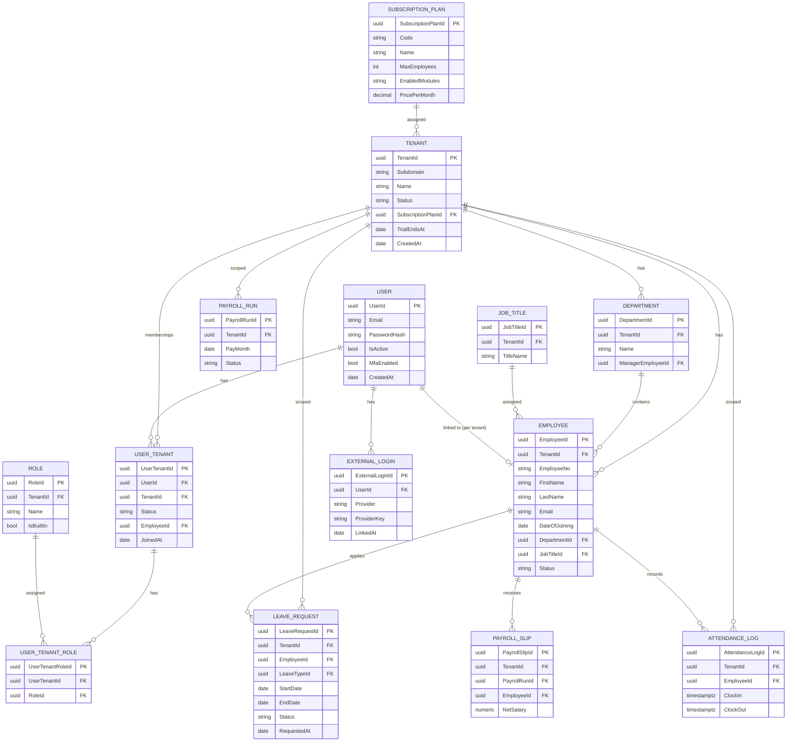

---

## 13. Class Diagram

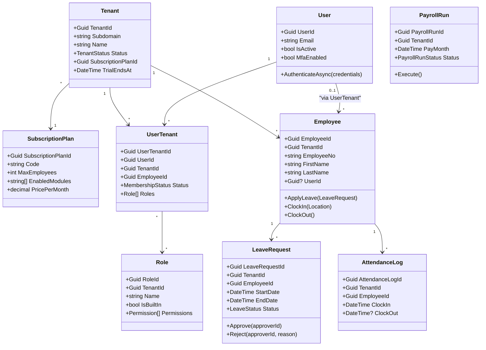

---

## 14. Use Case Diagram

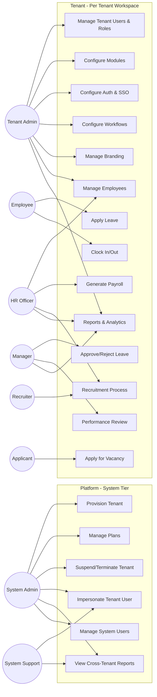

---

## 15. Sequence Diagrams

### 15.1 Tenant Resolution + Authentication
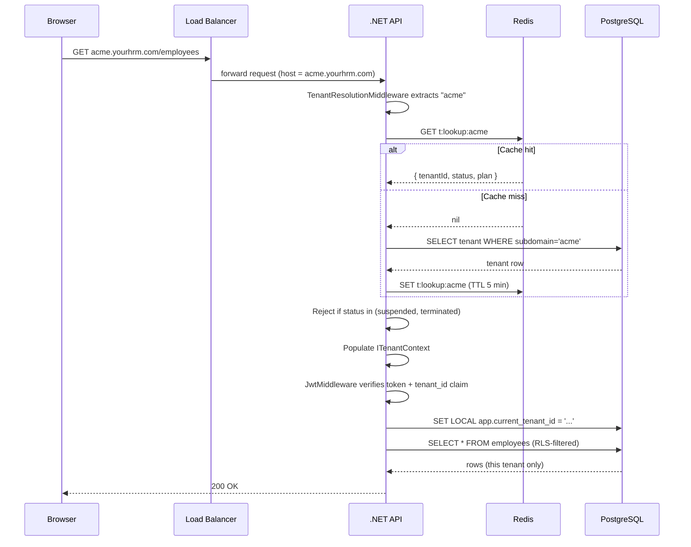

### 15.2 Social Login (Google) — Tenant-Scoped
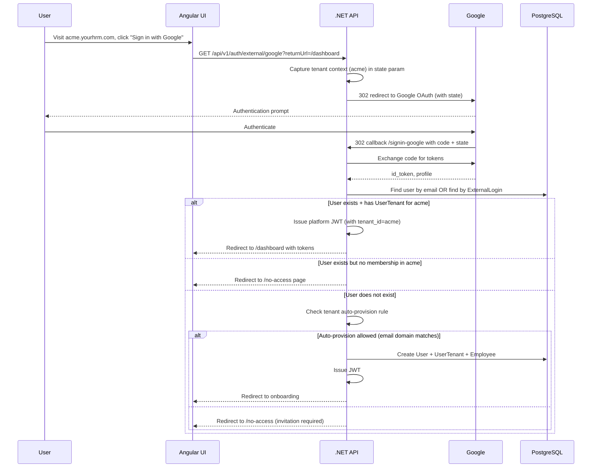

### 15.3 Tenant Provisioning (Manual, by System Admin)
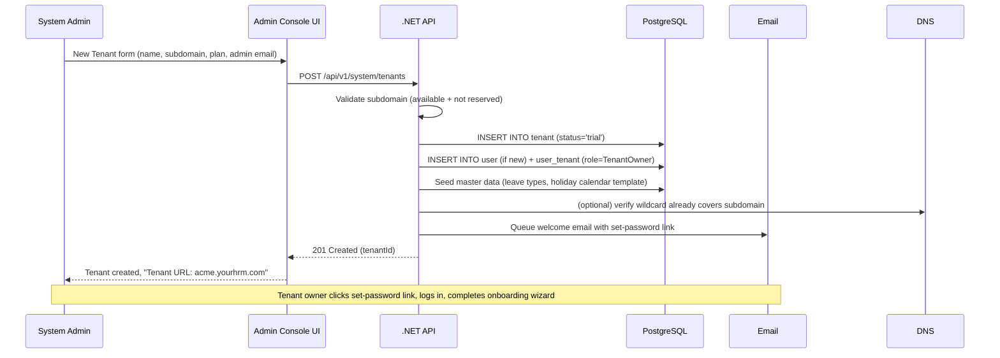

### 15.4 Leave Request Submission & Approval
```mermaid
sequenceDiagram
    participant Emp as Employee
    participant UI as Angular UI
    participant API as .NET API
    participant DB as PostgreSQL
    participant Mgr as Manager
    participant Notif as Notification Service

    Emp->>UI: Submit Leave Request
    UI->>API: POST /api/v1/leaves
    API->>API: Validate tenant + auth
    API->>DB: Validate balance, INSERT leave_request (tenant_id, status=Pending)
    DB-->>API: Success
    API->>Notif: Queue "leave-requested" notification
    API-->>UI: 201 Created
    UI-->>Emp: Pending

    Mgr->>UI: Open approvals queue
    UI->>API: GET /api/v1/leaves/pending
    API->>DB: SELECT pending (RLS-scoped to tenant; manager scope by team)
    DB-->>API: rows
    API-->>UI: list

    Mgr->>UI: Approve
    UI->>API: POST /api/v1/leaves/{id}/approve
    API->>DB: UPDATE status=Approved, write ledger, write audit
    API->>Notif: Queue "leave-approved" notification
    API-->>UI: 200 OK
```

### 15.5 Payroll Run
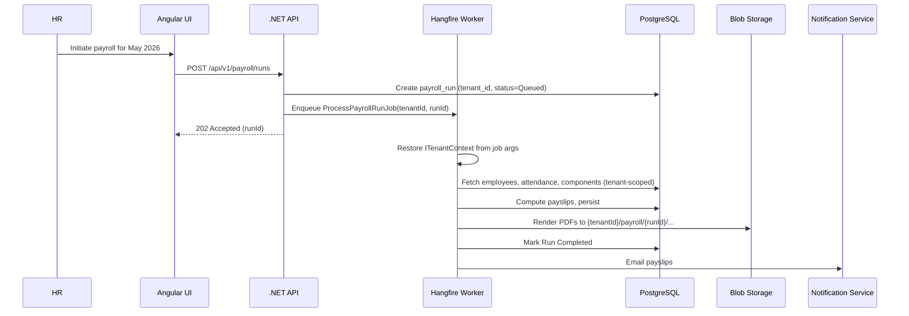

### 15.6 Tenant User Switch (Cross-Tenant User)
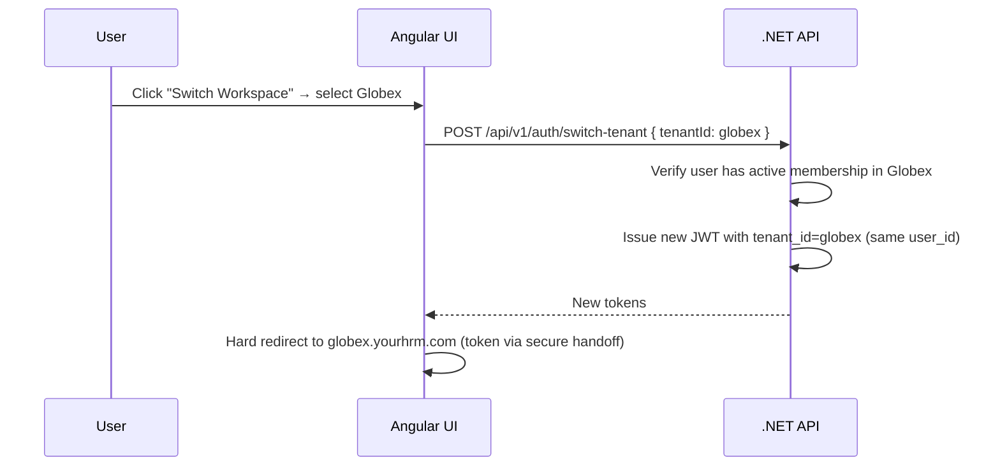

### 15.7 System Admin Impersonation
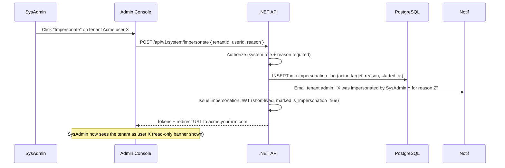

---

## 16. Activity Diagrams

### 16.1 Tenant Onboarding (after provisioning)
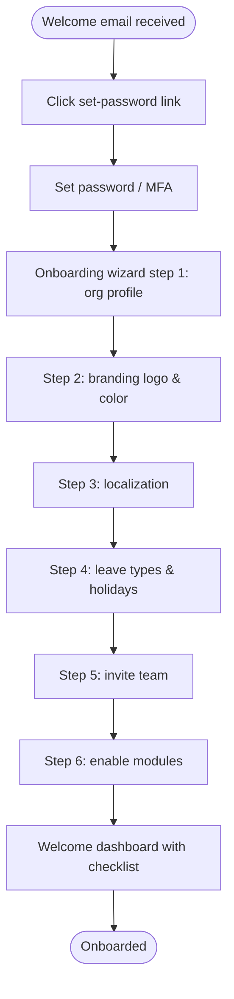

### 16.2 Leave Request
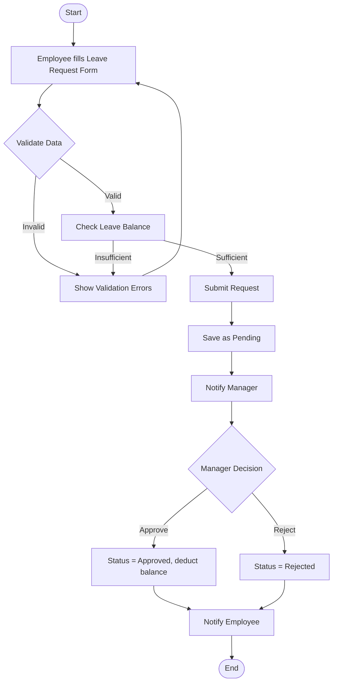

### 16.3 Recruitment
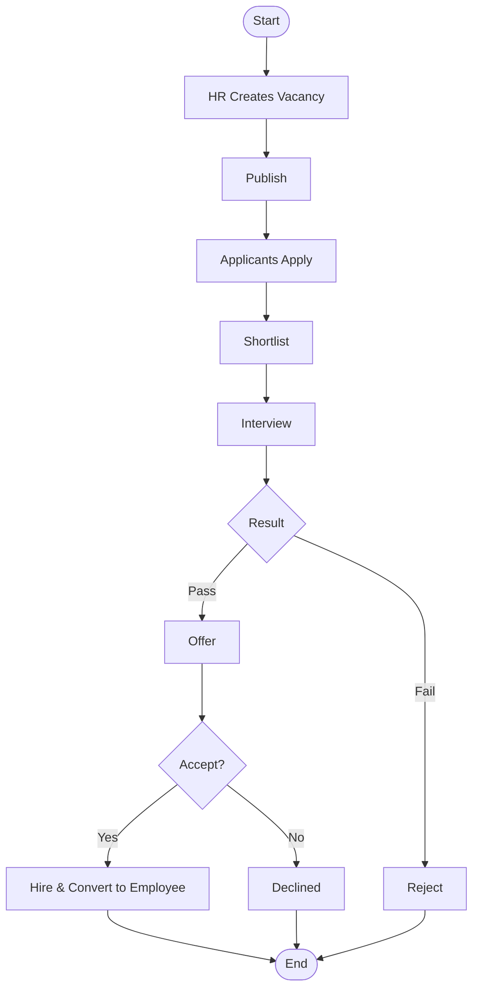

### 16.4 Payroll
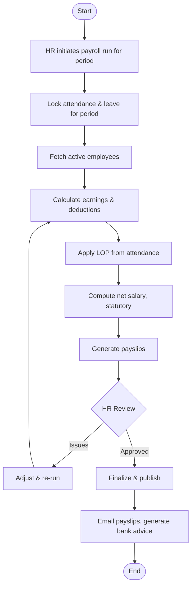

### 16.5 Tenant Lifecycle Transitions
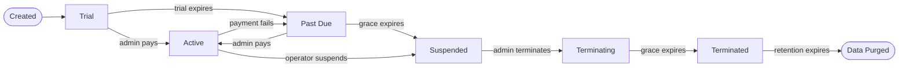

---

## 17. Component Diagram

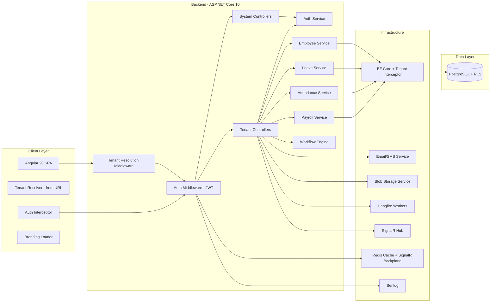

---

## 18. Deployment Diagram

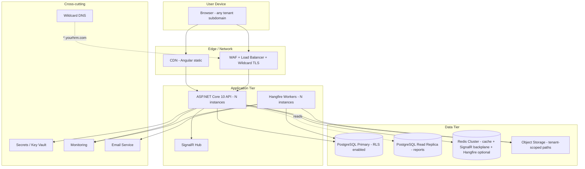

### 18.1 Environments
| Env | Purpose | Tenant Strategy |
|-----|---------|-----------------|
| Local | Developer machine | Seeded multi-tenant fixture (3 fake tenants) |
| Dev | Continuous deployment from `develop` | Multi-tenant; refreshed weekly |
| QA / Test | Manual & automated testing | Multi-tenant; masked subset of prod |
| UAT | Stakeholder sign-off | Production-like; pilot tenants |
| Staging | Final pre-prod verification | Production-like |
| Production | Live | Real tenants |

---

## 19. Database Design

> **Platform:** PostgreSQL 14+ via Npgsql / EF Core (`Npgsql.EntityFrameworkCore.PostgreSQL` 10.x).
> **Multi-tenancy:** Shared database, shared schema. Every business table has a `tenant_id uuid NOT NULL` column. EF Core global query filters scope all queries to the current tenant. PostgreSQL Row-Level Security (RLS) policies enforce isolation at the database layer.
> **Naming convention:** `snake_case` via `EFCore.NamingConventions`; .NET entities remain `PascalCase`.

### 19.1 Normalization (3NF)
1NF: atomic values. 2NF: no partial dependencies. 3NF: no transitive dependencies.

Reporting tables / materialized views may be denormalized for query performance — by design, not by accident.

### 19.2 Platform Tables (Cross-Tenant)
These tables live outside per-tenant RLS — they describe the tenants themselves.

**tenant**
| Column | Type | Notes |
|--------|------|-------|
| tenant_id | uuid (PK) | UUIDv7 |
| subdomain | varchar(50) | Unique, lowercase, validated against reserved list |
| name | varchar(200) | Display name |
| status | varchar(20) | `trial` / `active` / `past_due` / `suspended` / `terminating` / `terminated` |
| subscription_plan_id | uuid (FK) | |
| region | varchar(20) | For future multi-region |
| trial_ends_at | date | Nullable |
| suspended_at | timestamptz | Nullable |
| suspended_reason | varchar(500) | Nullable |
| termination_scheduled_at | timestamptz | Nullable; data deletion target |
| primary_owner_user_id | uuid (FK) | |
| billing_email | varchar(150) | |
| is_system | boolean | True only for the platform system tenant |
| created_at | timestamptz | |
| updated_at | timestamptz | |
| *(concurrency)* | *xmin (system)* | |

**subscription_plan**
| Column | Type | Notes |
|--------|------|-------|
| subscription_plan_id | uuid (PK) | |
| code | varchar(50) | Unique (`starter`, `growth`, `business`, `enterprise`) |
| name | varchar(100) | Display name |
| is_public | boolean | Visible on pricing page |
| is_active | boolean | Available for new tenants |
| max_employees | int | NULL = unlimited |
| max_storage_gb | int | NULL = unlimited |
| max_api_calls_per_month | bigint | NULL = unlimited |
| max_email_sends_per_month | int | NULL = unlimited |
| max_custom_roles | int | NULL = unlimited |
| max_custom_fields_per_entity | int | NULL = unlimited |
| max_workflows | int | NULL = unlimited |
| enabled_modules | jsonb | Array of module codes |
| feature_flags | jsonb | `{ sso: true, custom_domain: false, ... }` |
| audit_log_retention_days | int | |
| sla_tier | varchar(20) | `none` / `standard` / `priority` / `enterprise` |
| trial_days | int | |
| price_per_month | numeric(18,2) | |
| price_per_year | numeric(18,2) | |
| currency | char(3) | |
| created_at | timestamptz | |

**tenant_setting** (per-tenant overrides of plan defaults)
| Column | Type | Notes |
|--------|------|-------|
| tenant_id | uuid (PK, FK) | |
| key | varchar(100) (PK) | Composite PK with tenant_id |
| value | jsonb | |
| updated_at | timestamptz | |
| updated_by | uuid | |

**plan_limit_override** (negotiated bespoke limits)
| Column | Type | Notes |
|--------|------|-------|
| plan_limit_override_id | uuid (PK) | |
| tenant_id | uuid (FK) | |
| limit_key | varchar(50) | e.g., `max_employees` |
| value | bigint | |
| expires_at | timestamptz | Nullable |
| created_by | uuid | System admin |

**feature_flag**
| Column | Type | Notes |
|--------|------|-------|
| feature_flag_id | uuid (PK) | |
| key | varchar(100) | Unique |
| description | varchar(500) | |
| default_state | boolean | |

**feature_flag_tenant**
| Column | Type | Notes |
|--------|------|-------|
| feature_flag_id | uuid (PK, FK) | |
| tenant_id | uuid (PK, FK) | |
| state | boolean | Tenant-specific override |

### 19.3 Identity Tables

**users** (global — one user, many tenant memberships)
| Column | Type | Notes |
|--------|------|-------|
| user_id | uuid (PK) | UUIDv7 |
| email | varchar(150) | Unique platform-wide (case-insensitive) |
| email_verified | boolean | |
| password_hash | varchar(500) | Nullable (social-only users) |
| password_changed_at | timestamptz | |
| mfa_enabled | boolean | |
| mfa_secret | varchar(200) | Encrypted at column level |
| display_name | varchar(200) | |
| is_active | boolean | Global active state |
| failed_login_count | int | |
| locked_until | timestamptz | Nullable |
| created_at | timestamptz | |
| *(concurrency)* | *xmin* | |

**user_tenant** (membership)
| Column | Type | Notes |
|--------|------|-------|
| user_tenant_id | uuid (PK) | |
| user_id | uuid (FK) | |
| tenant_id | uuid (FK) | |
| employee_id | uuid (FK) | Nullable — links to Employee record within the tenant |
| status | varchar(20) | `invited` / `active` / `disabled` |
| invited_by_user_id | uuid (FK) | Nullable |
| invited_at | timestamptz | Nullable |
| joined_at | timestamptz | Nullable |
| last_active_at | timestamptz | Nullable |
| *(concurrency)* | *xmin* | |

> Unique constraint: `(user_id, tenant_id)` — one membership per user per tenant.

**role** (tenant-scoped role definitions)
| Column | Type | Notes |
|--------|------|-------|
| role_id | uuid (PK) | |
| tenant_id | uuid (FK) | NULL for built-in system-tenant roles |
| name | varchar(100) | Unique within tenant |
| description | varchar(500) | |
| is_built_in | boolean | Cannot be edited/deleted |
| created_at | timestamptz | |

**role_permission**
| Column | Type | Notes |
|--------|------|-------|
| role_id | uuid (PK, FK) | |
| permission | varchar(100) (PK) | e.g., `Leave.Approve.Team` |

**user_tenant_role** (many-to-many: membership ↔ roles)
| Column | Type | Notes |
|--------|------|-------|
| user_tenant_id | uuid (PK, FK) | |
| role_id | uuid (PK, FK) | |
| assigned_at | timestamptz | |
| assigned_by | uuid | |

**external_login** (social provider links)
| Column | Type | Notes |
|--------|------|-------|
| external_login_id | uuid (PK) | |
| user_id | uuid (FK) | |
| provider | varchar(50) | `Google` / `Microsoft` / `Apple` / `Saml:{idp}` |
| provider_key | varchar(500) | The `sub` from the IdP |
| email_at_link | varchar(150) | Snapshot |
| linked_at | timestamptz | |

> Unique constraint: `(provider, provider_key)`.

**refresh_token**
| Column | Type | Notes |
|--------|------|-------|
| refresh_token_id | uuid (PK) | |
| user_id | uuid (FK) | |
| tenant_id | uuid (FK) | The tenant context this token was issued for |
| token_hash | varchar(500) | SHA-256 of the actual token |
| issued_at | timestamptz | |
| expires_at | timestamptz | |
| revoked_at | timestamptz | Nullable |
| replaced_by_token_id | uuid | Nullable (rotation chain) |
| user_agent | varchar(500) | |
| ip_address | varchar(50) | |

**user_invitation**
| Column | Type | Notes |
|--------|------|-------|
| user_invitation_id | uuid (PK) | |
| tenant_id | uuid (FK) | |
| email | varchar(150) | |
| invited_role_ids | jsonb | Array |
| token_hash | varchar(500) | One-time link |
| invited_by | uuid | |
| invited_at | timestamptz | |
| expires_at | timestamptz | |
| accepted_at | timestamptz | Nullable |

### 19.4 Tenant Lifecycle & Audit Tables

**tenant_lifecycle_event**
| Column | Type | Notes |
|--------|------|-------|
| event_id | uuid (PK) | |
| tenant_id | uuid (FK) | |
| event_type | varchar(50) | `created` / `trial_started` / `activated` / `payment_failed` / `suspended` / `reactivated` / `terminated` |
| actor_user_id | uuid | Nullable (system events) |
| reason | varchar(500) | Nullable |
| metadata | jsonb | |
| occurred_at | timestamptz | |

**impersonation_log**
| Column | Type | Notes |
|--------|------|-------|
| impersonation_log_id | uuid (PK) | |
| actor_system_user_id | uuid | |
| target_tenant_id | uuid (FK) | |
| target_user_id | uuid (FK) | |
| reason | varchar(500) | Required |
| started_at | timestamptz | |
| ended_at | timestamptz | Nullable |
| actions_summary | jsonb | What the impersonator did |

**system_audit_log** (system-tier audit, separate from per-tenant audit)
| Column | Type | Notes |
|--------|------|-------|
| system_audit_log_id | bigserial (PK) | |
| timestamp | timestamptz | |
| actor_system_user_id | uuid | |
| action | varchar(100) | |
| resource_type | varchar(50) | |
| resource_id | varchar(100) | |
| tenant_id | uuid | Nullable (when action targets a tenant) |
| before | jsonb | |
| after | jsonb | |
| ip_address | varchar(50) | |
| trace_id | varchar(100) | |

### 19.5 Core HR Tables (Per Tenant)

**employee**
| Column | Type | Notes |
|--------|------|-------|
| employee_id | uuid (PK) | |
| tenant_id | uuid (FK) | RLS-enforced |
| employee_no | varchar(50) | Unique per tenant |
| first_name | varchar(100) | |
| last_name | varchar(100) | |
| email | varchar(150) | Unique per tenant |
| phone | varchar(20) | |
| date_of_joining | date | |
| status | varchar(20) | `active` / `inactive` / `on_leave` / `terminated` |
| department_id | uuid (FK) | |
| job_title_id | uuid (FK) | |
| user_id | uuid (FK) | Nullable — global user record |
| custom_fields | jsonb | Tenant-defined fields |
| created_at | timestamptz | |
| created_by | uuid | |
| updated_at | timestamptz | |
| updated_by | uuid | |
| is_deleted | boolean | |
| *(concurrency)* | *xmin* | |

**department**
| Column | Type | Notes |
|--------|------|-------|
| department_id | uuid (PK) | |
| tenant_id | uuid (FK) | |
| name | varchar(150) | Unique per tenant |
| manager_employee_id | uuid (FK) | Nullable |
| parent_department_id | uuid (FK) | Nullable — org tree |

**job_title**
| Column | Type | Notes |
|--------|------|-------|
| job_title_id | uuid (PK) | |
| tenant_id | uuid (FK) | |
| title_name | varchar(150) | Unique per tenant |
| grade_id | uuid (FK) | Nullable |

### 19.6 Leave Tables (Per Tenant)

**leave_type**, **leave_request**, **leave_approval_history**, **leave_ledger**, **holiday** — all carry `tenant_id` and RLS policies. Schema follows v3.1 with `tenant_id uuid NOT NULL` added as the first non-PK column.

### 19.7 Attendance Tables (Per Tenant)
**shift**, **employee_shift**, **attendance_log**, **attendance_regularization** — all carry `tenant_id` with RLS.

### 19.8 Payroll Tables (Per Tenant)
**salary_component**, **employee_salary_component**, **payroll_run**, **payroll_slip**, **payroll_slip_detail** — all carry `tenant_id` with RLS.

### 19.9 Audit & Notification Tables (Per Tenant)

**audit_log**
| Column | Type | Notes |
|--------|------|-------|
| audit_log_id | bigserial (PK) | |
| tenant_id | uuid | RLS-enforced |
| timestamp | timestamptz | |
| actor_user_id | uuid | |
| actor_employee_no | varchar(50) | |
| action | varchar(100) | |
| resource_type | varchar(50) | |
| resource_id | varchar(100) | |
| before | jsonb | |
| after | jsonb | |
| ip_address | varchar(50) | |
| user_agent | varchar(500) | |
| trace_id | varchar(100) | |

**notification_template**, **notification_outbox** — tenant-scoped.

### 19.10 Common Patterns

**Audit columns:** `created_at`, `created_by`, `updated_at`, `updated_by` on every business table.

**Soft delete:** `is_deleted boolean DEFAULT false`; EF Core global filter excludes; hard delete via admin tooling with audit.

**Concurrency:** PG `xmin` system column as EF Core token (`UseXminAsConcurrencyToken()`).

**Tenant marker interface (.NET):**
```csharp
public interface IMultiTenant { Guid TenantId { get; set; } }
```
EF interceptor:
- Auto-fills `TenantId` on insert from `ITenantContext`.
- Rejects writes where `TenantId` does not match context.

**EF global query filter (applied to every `IMultiTenant` entity):**
```csharp
modelBuilder.Entity<Employee>()
    .HasQueryFilter(e => e.TenantId == _tenantContext.TenantId);
```

**Configuration snippet (`Program.cs`):**
```csharp
builder.Services.AddDbContext<HrmDbContext>((sp, opt) =>
{
    var tenantContext = sp.GetRequiredService<ITenantContext>();
    opt.UseNpgsql(
            builder.Configuration.GetConnectionString("Hrm"),
            o => o.SetPostgresVersion(16, 0))
       .UseSnakeCaseNamingConvention()
       .AddInterceptors(new TenantSavingInterceptor(tenantContext),
                        new SetTenantSessionInterceptor(tenantContext));
});
```

The `SetTenantSessionInterceptor` issues `SET LOCAL app.current_tenant_id = '<guid>'` on every command so RLS policies see the right tenant.

### 19.11 PostgreSQL Row-Level Security (RLS)

**Pattern applied to every per-tenant table:**
```sql
ALTER TABLE employee ENABLE ROW LEVEL SECURITY;
ALTER TABLE employee FORCE ROW LEVEL SECURITY;

CREATE POLICY tenant_isolation_select ON employee
    FOR SELECT
    USING (tenant_id = current_setting('app.current_tenant_id')::uuid);

CREATE POLICY tenant_isolation_modify ON employee
    FOR ALL
    USING       (tenant_id = current_setting('app.current_tenant_id')::uuid)
    WITH CHECK  (tenant_id = current_setting('app.current_tenant_id')::uuid);
```

**Bypass for migrations / system operations:** a dedicated DB role (e.g., `hrm_migrator`) with `BYPASSRLS` runs schema changes and explicit cross-tenant scripts. Application code uses the `hrm_app` role which does **not** have `BYPASSRLS`.

**Why both EF filter and RLS?**
- EF filter catches mistakes early (developer ergonomics, clear errors).
- RLS catches anything EF misses (raw SQL, mis-configured queries, future ORM swap).
- Two independent layers → no single point of failure for the most critical security property.

### 19.12 Indexing Strategy
- Every `tenant_id` column is indexed (typically as the leading column of composite indexes).
- B-tree indexes on every FK.
- Composite indexes for common query patterns:
  - `attendance_log(tenant_id, employee_id, clock_in DESC)`
  - `leave_request(tenant_id, employee_id, status, start_date)`
  - `payroll_slip(tenant_id, payroll_run_id, employee_id)`
- Partial indexes for queues: `CREATE INDEX ix_leave_pending ON leave_request(tenant_id, start_date) WHERE status = 'Pending';`
- GIN indexes on `jsonb` columns (custom fields, audit payloads).
- BRIN indexes on append-only time-ordered tables (audit_log, attendance_log).
- Re-evaluate via `EXPLAIN (ANALYZE, BUFFERS)`.

### 19.13 Data Retention
| Data | Retention |
|------|-----------|
| Audit logs (per tenant) | 7 years (configurable; some plans = 90 days/1 year) |
| Attendance logs | 7 years |
| Payroll data | 7+ years (statutory) |
| Resignation / exit records | Permanent |
| Soft-deleted records | Until purge job |
| Application logs (Serilog) | 90 days hot, 1 year cold |
| Terminated-tenant data | Hard-deleted N days after `terminating` state (default 30) |
| Impersonation log | 7 years |
| System audit log | 7 years |

### 19.14 Type Mapping Reference (SQL Server → PostgreSQL)
| SQL Server | PostgreSQL | Notes |
|---|---|---|
| `int IDENTITY` | `int GENERATED BY DEFAULT AS IDENTITY` | EF handles |
| `datetime2` | `timestamptz` | Store as UTC |
| `bit` | `boolean` | |
| `varchar(n)` | `varchar(n)` or `text` | |
| `nvarchar(n)` | `varchar(n)` | PG is UTF-8 default |
| `decimal(p,s)` | `numeric(p,s)` | |
| `uniqueidentifier` | `uuid` | UUIDv7 generated client-side |
| `rowversion` | `xmin` system column | `UseXminAsConcurrencyToken()` |
| `varbinary(max)` | `bytea` | |
| JSON-as-string | `jsonb` | Indexable, queryable |

---

## 20. API Standards & Conventions

### 20.1 Path Structure
| Pattern | Purpose |
|---------|---------|
| `/api/v1/system/...` | System Admin operations (cross-tenant). Requires system-tier role. |
| `/api/v1/...` | Tenant-scoped operations. Tenant resolved from subdomain. |
| `/api/v1/auth/...` | Authentication endpoints (mixed — some need tenant context, some don't) |

### 20.2 Versioning
- URL versioning: `/api/v1/...`, `/api/v2/...`. Breaking changes bump major.

### 20.3 Naming
- Resources in plural nouns: `/employees`, `/leaves`.
- Sub-resources nested: `/employees/{id}/leaves`.
- Actions when non-CRUD: `POST /leaves/{id}/approve`.

### 20.4 HTTP Methods
GET = read (idempotent), POST = create / actions, PUT = full replace, PATCH = partial, DELETE = soft delete.

### 20.5 Standard Response Envelope
```json
{
  "success": true,
  "data": { ... },
  "errors": [],
  "meta": { "page": 1, "pageSize": 20, "totalRecords": 137 },
  "tenantId": "0192f...",
  "traceId": "00-abc123-xyz789-01"
}
```

### 20.6 Error Response
```json
{
  "success": false,
  "data": null,
  "errors": [
    { "code": "VALIDATION_ERROR", "field": "startDate",
      "message": "Start date cannot be in the past." }
  ],
  "tenantId": "0192f...",
  "traceId": "00-abc123-xyz789-01"
}
```

### 20.7 Status Codes
| Code | Use |
|------|-----|
| 200 | OK |
| 201 | Created |
| 202 | Accepted (async work queued) |
| 204 | No Content |
| 400 | Validation error |
| 401 | Unauthenticated |
| 402 | Tenant suspended for billing |
| 403 | Forbidden (authenticated but no permission, OR cross-tenant attempt) |
| 404 | Not Found |
| 409 | Conflict (concurrency, duplicate) |
| 410 | Tenant terminated |
| 422 | Business-rule failure |
| 429 | Rate-limited |
| 451 | Tenant suspended / plan limit exceeded |
| 500 | Server Error |

### 20.8 Pagination, Filtering, Sorting
- `?page=1&pageSize=20` (max 100).
- `?status=Active&departmentId=...`
- `?sortBy=lastName&sortOrder=asc`
- `?q=john`

### 20.9 Idempotency
Critical write endpoints (payroll trigger, payment, tenant provisioning) accept `Idempotency-Key` header; result cached ≥ 24h.

### 20.10 Rate Limiting
- Per-user defaults: 100 req/min read, 30 req/min write.
- Per-tenant aggregate ceiling from plan.
- System-admin endpoints exempt (audited heavily instead).
- 429 with `Retry-After`.

### 20.11 CORS
Allowed origins explicitly: `https://*.yourhrm.com`, `https://yourhrm.com` (the marketing site). Credentials enabled for refresh-token cookies.

### 20.12 Tenant Context in Requests
- For tenant endpoints: subdomain → middleware → context. Clients do NOT need to send `X-Tenant-Id`.
- For system endpoints: `admin.yourhrm.com` resolves to the system tenant; cross-tenant operations include the target `tenantId` in the URL or body.

### 20.13 OpenAPI / Swagger
- Auto-generated from controllers + XML doc.
- `/swagger` available in non-prod.
- Two documents: `system` and `tenant` — surfaces are very different.

---

## 21. Key API Endpoints

> Full reference is auto-generated in Swagger.

### 21.1 Authentication & Identity (mixed scope)
| Method | Path | Description |
|--------|------|-------------|
| POST | `/api/v1/auth/login` | Local username/password login (tenant-scoped via subdomain) |
| GET | `/api/v1/auth/external/{provider}` | Initiate social login (Google / Microsoft / Apple) |
| GET | `/signin-{provider}` | OAuth callback (handled by middleware) |
| POST | `/api/v1/auth/refresh` | Exchange refresh token |
| POST | `/api/v1/auth/logout` | Revoke refresh token |
| POST | `/api/v1/auth/switch-tenant` | Issue new JWT for another tenant the user belongs to |
| GET | `/api/v1/auth/me` | Current user + tenant context + memberships |
| GET | `/api/v1/auth/my-tenants` | All tenants this user belongs to |
| POST | `/api/v1/auth/mfa/enroll` | Begin TOTP enrollment |
| POST | `/api/v1/auth/mfa/verify` | Verify TOTP code |
| POST | `/api/v1/auth/forgot-password` | Trigger reset email |
| POST | `/api/v1/auth/reset-password` | Set new password with reset token |
| POST | `/api/v1/auth/change-password` | Authenticated change |
| GET | `/api/v1/auth/invitations/{token}` | Inspect invitation |
| POST | `/api/v1/auth/invitations/{token}/accept` | Accept invitation |

### 21.2 System Admin (under `/api/v1/system`, requires system role)
| Method | Path | Description |
|--------|------|-------------|
| GET | `/api/v1/system/tenants` | List tenants (filters) |
| POST | `/api/v1/system/tenants` | Provision a new tenant |
| GET | `/api/v1/system/tenants/{id}` | Tenant detail |
| PATCH | `/api/v1/system/tenants/{id}` | Edit tenant |
| POST | `/api/v1/system/tenants/{id}/suspend` | Suspend |
| POST | `/api/v1/system/tenants/{id}/reactivate` | Reactivate |
| POST | `/api/v1/system/tenants/{id}/terminate` | Schedule termination |
| POST | `/api/v1/system/tenants/{id}/impersonate` | Impersonate a user in this tenant |
| POST | `/api/v1/system/tenants/{id}/export` | Trigger full export |
| GET | `/api/v1/system/tenants/{id}/usage` | Usage metrics |
| GET | `/api/v1/system/plans` | List plans |
| POST | `/api/v1/system/plans` | Create plan |
| PUT | `/api/v1/system/plans/{id}` | Update plan |
| POST | `/api/v1/system/tenants/{id}/plan` | Change tenant plan |
| GET | `/api/v1/system/audit-log` | Cross-tenant audit search |
| GET | `/api/v1/system/health/tenants` | Health overview |
| GET | `/api/v1/system/users` | System staff users |
| GET | `/api/v1/system/feature-flags` | Manage flags |

### 21.3 Tenant Admin (under `/api/v1/tenant`)
| Method | Path | Description |
|--------|------|-------------|
| GET | `/api/v1/tenant/profile` | Org profile |
| PUT | `/api/v1/tenant/profile` | Update profile |
| PUT | `/api/v1/tenant/branding` | Logo, colors |
| GET | `/api/v1/tenant/usage` | Current usage |
| GET | `/api/v1/tenant/users` | Tenant members |
| POST | `/api/v1/tenant/users/invite` | Invite user |
| PATCH | `/api/v1/tenant/users/{id}` | Update membership |
| POST | `/api/v1/tenant/users/{id}/deactivate` | Deactivate |
| POST | `/api/v1/tenant/users/{id}/sessions/revoke` | End sessions |
| GET / POST / PUT / DELETE | `/api/v1/tenant/roles[/{id}]` | Roles |
| PUT | `/api/v1/tenant/auth-settings` | Enabled providers, MFA, domain restrictions |
| GET / PUT | `/api/v1/tenant/password-policy` | |
| GET / PUT | `/api/v1/tenant/notification-templates/{key}` | Template editor |
| GET | `/api/v1/tenant/audit-log` | Tenant audit |

### 21.4 Core HR / Leave / Attendance / Recruitment / Payroll / Performance / Reports
Same as v3.1 §20. All scoped to the resolved tenant; no explicit `tenantId` parameter required.

---

## 22. Authentication & Social Login

This section consolidates the authentication design for the platform, including the three social providers requested (Microsoft, Google, Apple).

### 22.1 Architectural Choice
**Self-hosted: ASP.NET Core Identity + JWT + first-party OAuth handlers.**

Rationale:
- Full control over user/role/permission data, which is required for our RBAC model.
- No per-user pricing.
- Microsoft's first-party libraries are well-maintained; the only third-party library is for Apple.
- Forward-compatible — if we outgrow it, OpenIddict (or a managed IdP) can replace just the issuance layer.

### 22.2 NuGet Packages
| Package | Purpose |
|---|---|
| `Microsoft.AspNetCore.Identity.EntityFrameworkCore` | User / role storage in PostgreSQL |
| `Microsoft.AspNetCore.Authentication.JwtBearer` | Validates platform-issued JWTs |
| `Microsoft.AspNetCore.Authentication.Google` | Google sign-in |
| `Microsoft.AspNetCore.Authentication.OpenIdConnect` | Microsoft Entra / work accounts |
| `Microsoft.AspNetCore.Authentication.MicrosoftAccount` | Optional: consumer Microsoft accounts |
| `AspNet.Security.OAuth.Apple` (v10.x) | Sign in with Apple |
| `Microsoft.IdentityModel.Tokens` | JWT signing & validation |
| `BCrypt.Net-Next` *(or Identity defaults)* | Password hashing |
| `Otp.NET` | TOTP for MFA |

### 22.3 JWT Design
- **Access token:** ~15 min, signed RS256 with a key from Key Vault.
- **Refresh token:** opaque, ~7 days, rotated on each refresh, persisted hashed in `refresh_token` table.
- **Claims include:** `sub` (user_id), `email`, `tenant_id`, `user_tenant_id`, `roles[]`, `permissions[]`, `is_impersonation` (when set), `iat`, `exp`.
- **Refresh token transport:** `httpOnly; Secure; SameSite=Strict` cookie (preferred) — protects from XSS exfiltration.
- **Key rotation:** signing key rotated quarterly; previous key kept valid for token lifetime.
- **Reuse detection:** if a refresh token is presented after being rotated, the entire chain is revoked and the user notified.

### 22.4 Authentication Flow — Local Credentials
```
1. SPA → POST /api/v1/auth/login with { email, password, mfaCode? }
2. API verifies password (BCrypt or Identity hasher)
3. If MFA required → returns 200 with { mfaChallenge } and no token
4. Resolve user's memberships in the tenant resolved from subdomain
5. If no active membership → 403
6. Issue access + refresh tokens (refresh in httpOnly cookie)
7. Return { accessToken, user, tenant, permissions }
```

### 22.5 Authentication Flow — Social Login (Google / Microsoft / Apple)
```
1. SPA → window.location = /api/v1/auth/external/{provider}?returnUrl=...
   - Tenant subdomain is in the URL, captured in OAuth state
2. API ChallengeAsync({provider}) → 302 to IdP
3. User authenticates at IdP, consents
4. IdP redirects to /signin-{provider} with code
5. Middleware exchanges code → id_token, profile
6. Find user by ExternalLogin OR by email (auto-link if domain-restricted)
7. Find active UserTenant in the resolved tenant
8. If not found:
   - If tenant auto-provision allowed and email domain matches → create User + UserTenant
   - Else → redirect to /no-access (invitation needed)
9. Issue platform JWT + refresh token (with tenant_id claim)
10. Redirect back to SPA with tokens
```

### 22.6 Microsoft Work Accounts vs Consumer
- For corporate HRM use, prefer `OpenIdConnect` pointed at `https://login.microsoftonline.com/common/v2.0` — this accepts both personal *and* work accounts.
- `MicrosoftAccount` handler is consumer-only (Outlook.com / Hotmail) and rarely what you want for an HRM.

### 22.7 Sign in with Apple — Specifics
- Requires **Apple Developer Program** membership ($99/year).
- Three Apple identifiers needed:
  - **Bundle ID** (App ID)
  - **Services ID** — acts as OAuth `client_id` for web
  - **Sign In with Apple Key** — `.p8` private key file
- Apple's "client secret" is a JWT you sign with ES256 using the `.p8` key (valid up to 6 months). The library handles generation.
- Apple sends **name and email only on first authentication**. Persist immediately.
- Many users get a **private relay email** (`xyz@privaterelay.appleid.com`). Treat as authoritative for delivery but don't expect a real address.
- Domain verification required: host `apple-developer-domain-association.txt` at `/.well-known/`.
- HTTPS required even in development (use a tunnel like ngrok with a stable hostname registered with Apple).

### 22.8 Authentication Configuration (`Program.cs`)
```csharp
builder.Services
    .AddIdentityCore<ApplicationUser>(o => {
        o.Password.RequireDigit = true;
        o.Password.RequiredLength = 12;
        o.Lockout.MaxFailedAccessAttempts = 5;
        o.Lockout.DefaultLockoutTimeSpan = TimeSpan.FromMinutes(15);
    })
    .AddRoles<ApplicationRole>()
    .AddEntityFrameworkStores<HrmDbContext>()
    .AddDefaultTokenProviders();

builder.Services.AddAuthentication(opts =>
{
    opts.DefaultScheme = JwtBearerDefaults.AuthenticationScheme;
    opts.DefaultChallengeScheme = JwtBearerDefaults.AuthenticationScheme;
})
.AddJwtBearer(opts =>
{
    opts.TokenValidationParameters = new TokenValidationParameters {
        ValidIssuer   = cfg["Jwt:Issuer"],
        ValidAudience = cfg["Jwt:Audience"],
        IssuerSigningKey = new RsaSecurityKey(LoadSigningKey()),
        ValidateIssuer = true, ValidateAudience = true,
        ValidateLifetime = true, ValidateIssuerSigningKey = true,
        ClockSkew = TimeSpan.FromSeconds(30)
    };
})
.AddGoogle(o => {
    o.ClientId     = cfg["Auth:Google:ClientId"]!;
    o.ClientSecret = cfg["Auth:Google:ClientSecret"]!;
    o.SignInScheme = IdentityConstants.ExternalScheme;
})
.AddOpenIdConnect("Microsoft", o => {
    o.Authority    = "https://login.microsoftonline.com/common/v2.0";
    o.ClientId     = cfg["Auth:Microsoft:ClientId"]!;
    o.ClientSecret = cfg["Auth:Microsoft:ClientSecret"]!;
    o.ResponseType = "code";
    o.Scope.Add("email"); o.Scope.Add("profile");
    o.SignInScheme = IdentityConstants.ExternalScheme;
})
.AddApple(o => {
    o.ClientId = cfg["Auth:Apple:ServicesId"]!;
    o.TeamId   = cfg["Auth:Apple:TeamId"]!;
    o.KeyId    = cfg["Auth:Apple:KeyId"]!;
    o.PrivateKey = async (keyId, ct) =>
        (await File.ReadAllTextAsync($"keys/AuthKey_{keyId}.p8", ct)).AsMemory();
    o.SignInScheme = IdentityConstants.ExternalScheme;
});
```

### 22.9 Frontend (Angular 20) — What You Actually Need
For this server-side OAuth pattern, **no heavy OIDC library is required**:

1. **HTTP interceptor** — attaches `Authorization: Bearer <token>`, handles 401 → silent refresh. Built-in.
2. **Tenant guard** — verifies SPA bootstrapped with valid tenant context.
3. **Auth guard** — protects authenticated routes; redirects to login otherwise.
4. **Social buttons** — plain anchors pointing to `/api/v1/auth/external/{provider}?returnUrl=...`.
5. **Tenant-switch UI** — shows user's memberships, picks one, hits `/api/v1/auth/switch-tenant`.

If we later add **client-side OAuth**, evaluate:
- `angular-oauth2-oidc` (generic OIDC, well-maintained)
- `angular-auth-oidc-client` (alternative)
- `@azure/msal-angular` (only if Microsoft Graph integration drives it)

### 22.10 Per-Tenant Authentication Policy
The tenant admin controls (within the auth providers the platform offers):
- Enable/disable each provider for this tenant.
- Email domain restriction per provider — e.g., "only `@acme.com` may sign in via Google."
- Auto-provisioning: new email + matching domain → create membership, or invitation-only.
- MFA requirement: off / optional / required (with per-role overrides — e.g., admins always MFA).
- Session policy: idle timeout, absolute timeout, concurrent session limit.
- Password policy: length, complexity, rotation, history (for local accounts).
- IP allowlist *(enterprise — Phase 2)*.

### 22.11 Authorization Model
**RBAC** with permissions: `Module.Action[.Scope]` (e.g., `Leave.Approve.Team`).

Built-in roles (per tenant):
- Tenant Owner
- Tenant Admin
- HR Officer
- Manager
- Employee
- Recruiter
- Auditor

System roles (system tenant only):
- System Super Admin
- System Support
- System Billing
- System Compliance / Auditor

**Policies:**
```csharp
builder.Services.AddAuthorization(opt =>
{
    opt.AddPolicy("CanApproveTeamLeave", p =>
        p.RequireAuthenticatedUser()
         .RequireClaim("permission", "Leave.Approve.Team"));

    opt.AddPolicy("SystemAdmin", p =>
        p.RequireAuthenticatedUser()
         .RequireClaim("role", "SystemSuperAdmin", "SystemSupport"));

    opt.AddPolicy("TenantContextRequired", p =>
        p.RequireAuthenticatedUser()
         .RequireAssertion(ctx =>
             ctx.User.HasClaim(c => c.Type == "tenant_id")));
});
```

Resource-based (manager approves only their direct reports): `IAuthorizationService.AuthorizeAsync(user, leaveRequest, "CanApproveLeave")` with a custom handler.

### 22.12 Invitation Flow
1. Tenant admin invites email → `user_invitation` row created, email sent with one-time token.
2. Invitee clicks link → lands on `/accept-invitation?token=...` on `{tenant}.yourhrm.com`.
3. If email is new to platform: prompt to set password (or sign in with social).
4. If email exists: sign in normally; on success, add `user_tenant` row with the invited roles.
5. Invitation marked accepted; user enters the tenant.

### 22.13 Threat Considerations Specific to Multi-Tenant Auth
- **Tenant confusion attack:** a user with membership in tenant A presents a JWT with `tenant_id=B`. Middleware MUST re-verify the user's membership against the resolved subdomain on every request, not trust the token alone.
- **Social account hijack:** if a user's Google email changes ownership, a new "owner" could log into a stale ExternalLogin link. Mitigation: re-verify email change events from IdPs when supported; periodically re-prompt.
- **Subdomain takeover:** unprovisioned subdomains MUST resolve to a 404, never to a generic SPA shell that exposes login forms.
- **Cross-tenant impersonation:** only system admins can impersonate; impersonation always logged + tenant admin notified; impersonation JWTs cannot be refreshed past their original expiry.

---

## 23. Security & Authorization

### 23.1 Authentication
Covered in §22. Recap: JWT (15 min) + rotating refresh (7 d httpOnly cookie), TOTP MFA, account lockout, BCrypt/Identity hashing.

### 23.2 Authorization Layers
1. **Authentication middleware** — token validity, tenant claim matches resolved tenant.
2. **Role/policy authorization** — declarative on controllers/endpoints.
3. **Resource authorization** — runtime checks for record-level scope (e.g., manager's team).
4. **EF Core query filter** — automatic `tenant_id` scoping.
5. **PostgreSQL RLS** — DB-enforced tenant isolation.

### 23.3 OWASP Top 10 Controls
| Risk | Control |
|------|---------|
| Broken Access Control | Centralized authorization filters; tenant isolation tests; impersonation auditing |
| Cryptographic Failures | TLS 1.2+, storage encryption, `pgcrypto` for sensitive PII columns |
| Injection | EF Core parameterized; FluentValidation on inputs |
| Insecure Design | Threat modeling per release; abuse-case tests; tenant-isolation tests as a separate suite |
| Security Misconfig | Hardened images, secrets in vault, security headers |
| Vulnerable Components | Dependabot / Snyk on every PR |
| Auth Failures | Lockout, MFA, secure password reset, reuse detection on refresh tokens |
| Software & Data Integrity | Signed artifacts, SBOM |
| Logging Failures | Structured logs, alerts on auth anomalies, tenant-tagged |
| SSRF | URL allowlist on outbound calls; no user-supplied URLs fetched server-side |

### 23.4 Security Headers
`Content-Security-Policy`, `Strict-Transport-Security` (HSTS), `X-Content-Type-Options: nosniff`, `X-Frame-Options: DENY`, `Referrer-Policy: strict-origin-when-cross-origin`, `Permissions-Policy: camera=(), microphone=(), geolocation=(self)`.

### 23.5 Secrets Management
- No secret in source or `appsettings.json`.
- Local: User Secrets / `.env` (gitignored).
- Pipeline: variable groups / OIDC federation.
- Runtime: Azure Key Vault / AWS Secrets Manager / HashiCorp Vault.
- **Tenant-uploaded secrets** (e.g., SAML IdP cert, custom SMTP password) are stored encrypted (envelope encryption, KEK in vault) and never returned to the client in full.

### 23.6 Penetration Testing
- Annual third-party pen test (must include tenant-isolation testing).
- Quarterly internal scans (OWASP ZAP, Burp).
- Bug bounty program (Phase 2).

---

## 24. Audit Logging & Compliance

### 24.1 Two-Tier Audit
- **Tenant audit log** (`audit_log` per tenant): scoped to a tenant's own data and actions, visible to tenant admin and auditor roles.
- **System audit log** (`system_audit_log`): platform-operator actions, including tenant lifecycle, impersonation, plan changes, system user actions. Visible only to System Admin roles.

### 24.2 What's Audited
- Auth events: login success/failure, logout, password change, MFA enroll/disable, refresh-token rotation, account lockout.
- All write operations on: Employee, Payroll, Leave, User, Role, Settings, Tenant, Plan.
- PII reads of sensitive fields (bank account, national ID).
- Exports.
- Tenant lifecycle transitions.
- Impersonation: full session including actions taken.

### 24.3 Audit Record Shape
```json
{
  "auditId": 123456,
  "timestamp": "2026-05-11T14:32:11Z",
  "tenantId": "0192f...",
  "actorUserId": "0193a...",
  "actorEmployeeNo": "EMP0042",
  "action": "Leave.Approve",
  "resourceType": "LeaveRequest",
  "resourceId": "9871",
  "before": { "status": "Pending" },
  "after":  { "status": "Approved", "approvedBy": 42 },
  "ipAddress": "203.0.113.42",
  "userAgent": "Mozilla/5.0 …",
  "traceId": "00-abc-xyz-01"
}
```

### 24.4 Implementation
- EF Core `SaveChangesInterceptor` captures entity changes.
- Audit table is append-only; the application DB role lacks UPDATE/DELETE on it.
- Streaming export to ELK / Splunk for long-term storage.

### 24.5 Compliance
- **GDPR data subject rights** — export and erasure per user per tenant; tenant termination triggers tenant-wide hard deletion after grace.
- **Right to be forgotten** — anonymize PII (replace with `REDACTED-{id}`) while preserving statutory records.
- **Data minimization** — capture only what's needed.
- **Consent logs** for optional data (e.g., profile photo).
- **Data Processing Agreement (DPA)** template surfaced to tenants on signup.
- **Sub-processor list** maintained and surfaced.

---

## 25. Notification System

### 25.1 Channels
- **Email** (SMTP / SendGrid / ACS)
- **In-app** (SignalR + persisted notifications)
- **SMS** (Phase 2)
- **Webhook** (Phase 2)

### 25.2 Per-Tenant Customization
- Templates: each tenant can override system defaults with their own copy (with placeholders, plain-text + HTML, per-language variants).
- Sender identity: default platform "from" address. Enterprise tenants may configure a custom verified sender domain (`hr@acme.com`) — system surfaces required SPF/DKIM records.
- Channel preferences: which events trigger which channels, per audience (employee/manager/HR).
- Notification opt-outs (per user, per category).

### 25.3 Architecture
```
[Domain event raised in tenant context]
       │
       ▼
[Notification Dispatcher] → [Tenant template resolver] → [Channel adapters]
       │                                                  ├─ Email
       │                                                  ├─ In-app
       │                                                  └─ SMS
       ▼
[notification_outbox (per tenant) → Hangfire worker → provider]
```

### 25.4 Reliability
Outbox pattern: write notification intent in the same transaction as the business change. Worker dispatches with retry + dead-letter.

---

## 26. File & Document Management

### 26.1 Stored Documents
Profile photos, résumés, offer letters, contracts, payslip PDFs, leave supporting docs, onboarding documents, performance reports.

### 26.2 Storage
- Object storage (Azure Blob / S3 / MinIO); never on the app server filesystem.
- **Path convention (tenant-isolated):**
  `{tenantId}/{module}/{entityId}/{yyyy}/{mm}/{filename}`
- Files referenced from DB by URL or storage key. Files are private — only signed short-lived URLs are issued.
- Optional: per-tenant separate container or bucket for stricter isolation (enterprise plan).

### 26.3 Upload Rules
- Max size per file: 10 MB default (25 MB for résumés); plan-overridable.
- Allowed MIME types per upload type.
- Virus scanning (ClamAV or cloud service) before persisting URL.
- EXIF stripping for images.
- Optional encryption at rest with per-tenant KEK (enterprise).

### 26.4 Access Control
- Authorization check on every download.
- Signed URLs expire in minutes.
- Cross-tenant download attempts: 403 + alert.

---

## 27. Caching Strategy

### 27.1 What's Cached
| Data | TTL | Key |
|------|-----|-----|
| Tenant lookup by subdomain | 5 min | `t:lookup:{subdomain}` |
| Tenant metadata + plan | 5 min | `t:meta:{tenantId}` |
| Reference data (countries, currencies, system enums) | 1 hour | `ref:{key}` |
| Per-tenant leave types | 1 hour | `t:{tenantId}:leave-types` |
| User permissions for a membership | 5 min | `t:{tenantId}:perms:{userId}` |
| Holiday calendar | 1 hour | `t:{tenantId}:holidays:{year}` |
| Leave balance | On-demand | `t:{tenantId}:leave-balance:{employeeId}:{year}` |
| Heavy reports | 5–15 min | `t:{tenantId}:report:{name}:{paramsHash}` |

### 27.2 Patterns
- Cache-aside (default).
- Distributed locks (RedLock) on expensive recomputations.
- **Every cache key prefixed with tenant** (`t:{tenantId}:...`) — non-tenant keys explicitly use `sys:` prefix.
- Cache invalidation centralized — a `CacheInvalidationService` keyed off domain events.

### 27.3 Tenant Lifecycle ↔ Cache
- On tenant suspend/terminate: flush `t:{tenantId}:*` keys.
- On plan change: invalidate `t:meta:{tenantId}`.

---

## 28. Background Jobs & Scheduling

### 28.1 Framework
Hangfire with `Hangfire.PostgreSql` storage. Dashboard at `/hangfire` (system-admin protected). Workers are tenant-aware.

### 28.2 Tenant Awareness Pattern
- Every job method takes a `Guid tenantId` parameter (or a typed `JobArgs` containing it).
- A Hangfire `IServerFilter` runs before the job body, restores `ITenantContext`, and sets the PG session variable so RLS works.
- Recurring jobs that must run **for every active tenant** use a fan-out pattern: a master recurring job lists active tenants, then enqueues per-tenant jobs.

### 28.3 Recurring Jobs (fan-out across tenants)
| Job | Schedule | Purpose |
|-----|----------|---------|
| Monthly leave accrual | 1st of month, 00:30 (per tenant time zone) | Credit accrual |
| Year-end carry-forward | Tenant-configured date | Apply CF rules |
| Birthday / anniversary mailer | Daily 08:00 | Greetings |
| Probation/contract expiry | Daily 09:00 | Alerts |
| Document expiry | Daily 09:00 | Visa, contract |
| Trial-ending reminder | Daily | 7d, 3d, 1d before trial end |
| Past-due reminder | Daily | Dunning notifications |
| Backup verification | Daily 02:00 | Restore test |
| Audit log archival | Weekly | Move > 90d to cold storage |
| Soft-delete purge | Monthly | After retention |
| Terminated-tenant data purge | Daily | Hard delete past grace |
| Usage snapshot | Hourly | For plan quota tracking |

### 28.4 Triggered Jobs
Payroll run, bulk import, report generation, payslip rendering, notification dispatch — all tenant-scoped.

### 28.5 Operations
- Idempotency: jobs designed safely re-runnable.
- Distributed locks for must-not-run-concurrently jobs (monthly accrual per tenant).
- Each job logs start/end, correlation ID, processed-record counts, tenant context.

---

## 29. Real-time Features (SignalR)

### 29.1 Use Cases
New leave request banner for managers; payroll-completed for HR; new applicant for recruiter; live attendance board; in-app notification bell.

### 29.2 Architecture
- Single hub `/hubs/notifications`.
- JWT auth via query string or Authorization header.
- **Group naming (tenant-scoped):**
  - `t:{tenantId}:user:{userId}`
  - `t:{tenantId}:role:Manager`
  - `t:{tenantId}:team:{managerId}`
- Cross-tenant group names rejected.

### 29.3 Scaling
Multiple API instances → Redis backplane. Sticky sessions on load balancer.

---

## 30. Search Strategy

### 30.1 Phase 1
- PostgreSQL native full-text search using `tsvector` columns with GIN indexes — tenant-scoped via `tenant_id`.
- Trigram (`pg_trgm`) for fuzzy/partial matches.
- Search endpoints accept `?q=`.

### 30.2 Phase 2 (if needed)
- ElasticSearch / OpenSearch with tenant_id as a shard or routing key; per-tenant index for enterprise.
- CDC pipeline (Debezium on PG logical replication) keeps index in sync.

---

## 31. Internationalization & Localization

### 31.1 Frontend
- `ngx-translate` or Angular built-in i18n.
- Translation JSON files under `src/i18n/{lang}.json`.
- Tenant default language → user override → fall back to system default.
- Numbers, dates, currencies via Angular locale data.

### 31.2 Backend
- `IStringLocalizer<T>` for server-rendered strings (emails, PDFs).
- Resource files per culture.
- Per-tenant allowed-languages subset.

### 31.3 RTL
Tailwind RTL plugin / Angular Material bidi.

### 31.4 Time Zones
All datetimes stored UTC. Tenant default TZ; user override allowed.

---

## 32. Accessibility (a11y)
- Target: **WCAG 2.1 AA**.
- Semantic HTML, proper headings.
- All form fields labeled; error messages via `aria-describedby`.
- Keyboard navigation; visible focus.
- Color contrast ≥ 4.5:1.
- ARIA landmarks.
- Skip-to-content links.
- Lighthouse + axe-core in CI.
- Branding overrides must not break contrast — system validates tenant primary color choices.

---

## 33. Reporting & Analytics

### 33.1 Tenant-Scoped Reports (out of the box)
Headcount, joiners & leavers, attendance summary, leave balance & utilization, payroll totals, recruitment funnel, performance distribution, training participation.

### 33.2 Tenant Dashboards
- HR dashboard, Manager dashboard, Employee dashboard (see §31 in v3.1).

### 33.3 System-Level Reports (Platform Operator)
- MRR / ARR, churn, plan distribution, trial-to-paid conversion.
- Cross-tenant usage analytics (aggregated, no PII).
- SLA breach reports per tenant.
- Storage growth, API call volume per tenant.
- Failed payment queue.

### 33.4 Export Formats
CSV, Excel (.xlsx via ClosedXML), PDF (QuestPDF). Async generation for large exports.

### 33.5 Custom Report Builder *(Phase 2)*
Drag-and-drop fields from a curated entity catalog. Saved reports shareable within tenant.

---

## 34. Approval Workflow Engine

Per-tenant, configurable workflows used across modules (leave, attendance regularization, expense, offer, salary revision).

**Concepts**
- Workflow definition: entity type + version + ordered steps. Owned by tenant.
- Step: approver type (line manager / role / named user / department head), required action, SLA.
- Workflow instance: created when a request is submitted.
- Parallel vs sequential steps.

**Workflow state (per request)**
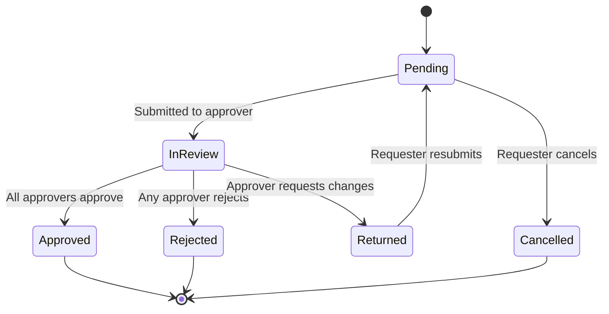

**Example: Leave Approval**
- Step 1: Direct manager (SLA 24h).
- Step 2 (only if > 5 days): Department head.
- Step 3 (only if > 15 days): HR.
- Escalation: SLA breach → notify next level.

---

## 35. Admin Console (System + Tenant)

### 35.1 System Admin Console (Platform Operator)
Accessible at `admin.yourhrm.com`. Authenticated against system-tenant context. All actions audited to `system_audit_log`.

**35.1.1 Tenant lifecycle & provisioning**
- Tenant list (search, filter by status, plan, region, created date, MRR)
- Create tenant (manual provisioning form)
- Tenant detail view (overview, usage, plan, owner)
- Edit / suspend / reactivate / terminate / restore
- Impersonate tenant user (with mandatory reason)
- Force password reset for tenant admin
- Tenant lifecycle history

**35.1.2 Subscription plans & pricing**
- Plan catalog: list, create, edit, archive
- Plan editor (price, currency, trial days, limits, modules, feature flags)
- Plan migration rules (proration policy)
- Custom plans for enterprise
- Coupons & discounts

**35.1.3 Per-tenant subscriptions & billing operations**
- View subscription
- Change plan (manual)
- Apply credits / discounts
- Manual invoice generation
- Invoice history
- Payment history
- Refunds
- Trial extension

**35.1.4 Revenue dashboard**
- MRR / ARR / ARPU / LTV
- New / churned / expanded MRR
- Trial-to-paid conversion
- Plan distribution
- Top tenants by revenue

**35.1.5 Domain registry**
- Reserved subdomains list
- Subdomain ↔ tenant mapping
- Custom domain management *(Phase 2)*

**35.1.6 System authentication & identity**
- Global social-provider credentials (client IDs / secrets / Apple key)
- Auth provider availability matrix (which providers tenants may enable)
- JWT signing key rotation
- Refresh-token kill switch (global / per-tenant)
- System admin auth policy (MFA, IP allowlist for admin console)

**35.1.7 System users & roles**
- Platform staff list (invite, edit, suspend, delete)
- System role editor (Super Admin, Support, Billing, Compliance)
- System audit log (cross-tenant)

**35.1.8 Monitoring & operations**
- Tenant health dashboard (status, error rate, latency per tenant)
- Per-tenant usage gauges (employees, storage, API, email)
- Quota breach queue
- API rate-limit dashboard
- Background jobs (Hangfire — cross-tenant view)
- Error / incident view (grouped, tenant-tagged)
- DB and Redis health
- SLA tracking

**35.1.9 Feature flags**
- Global flag list
- Per-tenant overrides
- Plan-based rollout
- Percentage rollout

**35.1.10 System notifications**
- Lifecycle email templates (trial ending, payment failed, suspension warning, welcome)
- Branding defaults
- Broadcast announcement
- Maintenance mode toggle

**35.1.11 Compliance**
- Cross-tenant audit log
- Data subject request management
- Tenant data export
- Tenant data deletion execution
- Compliance reports (SOC 2 evidence, access reports)
- PII access log

**35.1.12 Support tools**
- Tenant support view (debug info)
- Activity replay
- Login attempt logs per tenant
- Email delivery log

### 35.2 Tenant Admin Console (Customer)
Accessible at the tenant's subdomain. All actions audited to that tenant's `audit_log`.

**35.2.1 Organization profile**
- Company name, legal name, registration number
- Logo, favicon, brand colors
- Address, industry, size
- Time zone, currency, fiscal year start
- Date / number format
- Default language

**35.2.2 Subdomain & domain**
- Current subdomain
- Subdomain change request flow
- Custom domain *(Phase 2)*
- Tenant's email "from" domain (SPF/DKIM setup)

**35.2.3 Subscription & usage**
- Current plan + renewal date
- Usage gauges vs plan limits
- Invoice history (read-only Phase 1; self-service Phase 2)
- Update payment method *(Phase 2)*
- Tax / VAT ID
- Cancel subscription with retention flow + export option

**35.2.4 Users & access**
- User list (name, email, role, status, last login)
- Invite user (single + bulk CSV)
- Resend / revoke invitation
- User detail (link to employee, roles, audit)
- Activate / deactivate
- Force password reset
- End all sessions
- Pending invitations

**35.2.5 Roles & permissions**
- Built-in roles (read-only display)
- Custom roles *(Phase 2)*: clone & edit permission set
- Permission matrix editor
- Auto-assign roles based on department / job title / grade

**35.2.6 Authentication methods**
- Enabled providers (within system allowlist)
- Auto-provisioning rules (domain-restricted)
- Email domain restriction per provider
- MFA policy (off / optional / required; per-role overrides)
- Trusted MFA devices
- Session policy (idle / absolute / concurrent)
- IP allowlist *(enterprise — Phase 2)*
- Password policy
- SSO / SAML *(Phase 2)*

**35.2.7 Security & audit**
- Tenant audit log (filterable)
- Active sessions (view + terminate)
- Login activity
- Failed login alerts
- API tokens (service accounts)
- Data export request (GDPR)
- User data deletion request

**35.2.8 Master data**
- Departments (tree)
- Job titles
- Grades / bands
- Locations / branches (with TZ + holiday calendar)
- Employment types
- Custom fields (per entity)

**35.2.9 Module configurations**
- Leave (types, holiday calendars, probation rules, year start)
- Attendance (shifts, working days, grace, OT, geo-fence, IP allowlist for clock-in, photo requirement)
- Payroll (components, pay schedule, cutoff dates, bank advice format, payslip template, statutory)
- Recruitment (pipeline stages, application form, offer templates, interview score sheets, public careers page toggle)
- Performance (review cycles, rating scale, self vs manager weight, 360° toggle, calibration)
- Training, Asset Management (lite)

**35.2.10 Workflows**
- Workflow editor per request type
- Steps (sequential / parallel)
- SLA per step + auto-escalation
- Delegation
- Conditional steps

**35.2.11 Notifications & email**
- Template editor per event
- Template variable reference
- Multi-language template variants
- Notification preferences matrix (event × channel × audience)
- SMTP override (custom verified domain)
- DKIM/SPF setup
- Digest emails

**35.2.12 Branding & white-label**
- Logo (main + email + favicon)
- Color theme
- Login page customization
- Email header/footer
- PDF branding
- Custom CSS *(enterprise — Phase 2)*

**35.2.13 Localization**
- Default tenant language
- Allowed languages (subset)
- Per-user override toggle
- Date / time / number / currency formats

**35.2.14 Integrations**
- API tokens (Phase 1)
- Webhooks (Phase 2)
- Microsoft 365 / Google Workspace calendar sync (Phase 2)
- Slack / Teams (Phase 2)
- SCIM (Phase 2)

**35.2.15 Data management**
- Import wizards (employees, departments, attendance, salary)
- Export center
- Archive policy
- Bulk operations

**35.2.16 Reporting & dashboards**
- Saved reports
- Custom dashboard builder *(Phase 2)*
- Scheduled reports *(Phase 2)*

### 35.3 Plan Limits Catalog
What plans can constrain:

| Limit | Example values | Enforced where |
|---|---|---|
| Max employees / active users | 25 / 100 / 500 / unlimited | Hard block on create |
| Max storage (GB) | 5 / 25 / 100 / custom | Block uploads at threshold; warn at 80% |
| Max API requests per month | 10k / 100k / 1M / unlimited | Rate limiter |
| Max email sends per month | 5k / 50k / unlimited | Block at threshold |
| Max custom roles | 0 / 5 / unlimited | UI guard |
| Max custom fields per entity | 5 / 20 / unlimited | UI guard |
| Max approval workflows | 1 / 5 / unlimited | UI guard |
| Max integrations active | 1 / 5 / unlimited | UI guard |
| Max concurrent sessions per user | 1 / 3 / unlimited | Token issue check |
| Audit log retention (days) | 90 / 365 / 7y | Purge job |
| SLA tier | None / 99% / 99.5% / 99.9% | Report only |
| Data residency | Single / Choose region | Provisioning |
| Custom domain | No / Yes | Feature gate |
| White-label | No / Yes | Feature gate |
| SSO / SAML | No / Yes | Feature gate |
| SCIM | No / Yes | Feature gate |
| Priority support | None / Std / Priority / Dedicated CSM | Routing |
| Sandbox environment | No / Yes | Provisioning |

**Module toggles (independent of limits):** Core HR (always), Leave, Attendance, Recruitment, Onboarding/Offboarding, Payroll, Performance, Training, Asset, Benefits, Reporting, Custom report builder, Public careers page.

---

## 36. Tenant Lifecycle & Onboarding

### 36.1 Provisioning (Phase 1 — Manual)
1. Prospect / customer signs contract with platform operator.
2. System Admin opens "Create Tenant" form: name, subdomain, plan, primary owner email, region, trial days (if any).
3. Submit → backend validates subdomain, creates `tenant`, creates `user` (if new) and `user_tenant` with Tenant Owner role, seeds master data (default leave types, generic holiday calendar template, default workflows).
4. Welcome email sent with set-password link.
5. Owner clicks link, sets password / enables MFA / can also sign in via social.
6. Owner enters onboarding wizard.

### 36.2 Onboarding Wizard (Tenant Owner)
1. **Welcome & subscription summary** (plan, trial end date if applicable)
2. **Org profile** — name confirmation, time zone, currency, fiscal year
3. **Branding** (optional, skippable) — logo upload, primary color
4. **Localization** — default language, date format
5. **Master data starter** — confirm/edit default leave types & holiday calendar
6. **Modules** — confirm enabled modules from plan
7. **Workflows** — accept default leave approval or customize
8. **Invite team** — paste emails or upload CSV
9. **Welcome dashboard** — quick-start checklist; sample data toggle (Phase 2)

### 36.3 Self-Service Signup *(Phase 2)*
Same wizard, fronted by a public signup page (pricing → plan select → account create → email verify → wizard). Payment integration at the end.

### 36.4 Trial Management
- Default trial: 14 days (plan-configurable).
- Reminders at 7d, 3d, 1d, day-of via system templates.
- Trial expiry → `past_due` state.
- Tenant admin sees countdown banner.

### 36.5 Suspension
Triggers:
- Manual by System Admin (with reason).
- Payment failure after dunning (Phase 2).
- ToS violation.

Effects:
- Login allowed only for tenant admin (read-only view of "your tenant is suspended; reason; contact").
- Background jobs paused.
- API access blocked (451).
- Data preserved.

### 36.6 Termination
1. System Admin (or tenant admin self-cancel — Phase 2) initiates termination.
2. Tenant enters `terminating` state with grace period (default 30 days, plan-configurable).
3. During grace: read-only access; export endpoints active.
4. Reminders sent at 14d, 7d, 1d remaining.
5. On grace expiry: hard delete tenant data (all per-tenant tables purged where `tenant_id = X`). `tenant` row retained with `status='terminated'` for audit (PII redacted).
6. Audit logs retained per retention policy.

### 36.7 Data Export
Per-tenant full export bundle:
- All entities as CSV (one per entity).
- Documents (resumes, payslips) as a tar/zip.
- Audit log as JSON Lines.
- Schema documentation (PDF).
- Manifest with row counts & checksums.
Generated by a Hangfire job; URL emailed to billing contact.

### 36.8 Restoration
Within grace, restore is a single click. After hard delete, restore from backup is operator-only and requires customer agreement on the recovery point.

---

## 37. Logging, Monitoring & Observability

### 37.1 Logging (Serilog)
- Structured JSON, one event per record.
- Enrichers: `Environment`, `Application`, `Version`, `MachineName`, `TenantId`, `UserId`, `TraceId`.
- Sinks: console (containers), rolling file, ELK / App Insights / Seq.
- **Never log:** passwords, full tokens, full national IDs, full bank account numbers.
- All log queries support filtering by `tenant_id`.

### 37.2 Metrics
- ASP.NET Core built-in (requests, latency, error rate) tagged with `tenant_id`.
- Custom counters: `payroll.runs.completed`, `leave.requests.approved`, `tenant.api_calls`, `tenant.storage_bytes`.
- Per-tenant rollups for SLA reporting.
- Exported via OpenTelemetry.

### 37.3 Tracing
- W3C Trace Context propagated across services & jobs.
- `tenant_id` as span attribute.

### 37.4 Health Checks
- `/health/live` — process alive.
- `/health/ready` — DB, Redis, storage reachable.
- `/health/tenant/{id}` — tenant-specific health (internal use).

### 37.5 Alerting
| Signal | Threshold | Action |
|--------|-----------|--------|
| Platform error rate | > 2% / 5 min | Page on-call |
| Platform P95 latency | > 1.5s / 10 min | Page on-call |
| Single-tenant error rate | > 5% / 10 min | Notify ops |
| DB CPU | > 80% / 10 min | Notify |
| Failed login spike (system-wide) | 5× baseline | Notify security |
| Cross-tenant access attempt (RLS reject) | any | Page security |
| Hangfire failed jobs | > 10 in queue | Notify |
| Tenant approaching plan limit | 80% / 95% | Notify tenant admin + ops |
| Cert expiry | < 30 days | Notify |

---

## 38. Error Handling Strategy

### 38.1 Backend
- Global middleware catches all unhandled exceptions; produces consistent error envelope.
- Custom hierarchy:
  - `DomainException` → 422
  - `ValidationException` → 400
  - `NotFoundException` → 404
  - `ForbiddenException` → 403
  - `ConcurrencyException` → 409
  - `TenantSuspendedException` → 451
  - `TenantTerminatedException` → 410
  - `PlanLimitExceededException` → 451 with `LimitName` detail
  - Others → 500 (logged with `Error`; user sees generic message).
- Production never returns stack traces.
- All errors carry `traceId`.

### 38.2 Frontend
- HTTP interceptor maps responses:
  - 401 → silent refresh, retry; fail → login.
  - 403 → "No permission" toast.
  - 410/451 → "Tenant suspended/terminated/limit reached" full-screen banner.
  - 422 → field-level errors mapped to form.
  - 5xx → "Something went wrong" with traceId.
- Global error handler sends client exceptions to monitoring.

---

## 39. Testing Strategy

### 39.1 Test Pyramid
```
       ▲   E2E (Playwright) — happy paths, critical flows, tenant switching
       │   ───────────────────────────────────────────────
       │   Integration (xUnit + Testcontainers PG)
       │   ───────────────────────────────────────────────
       │   Unit — Domain + Application
```

### 39.2 Backend
| Layer | Tooling | Targets |
|-------|---------|---------|
| Unit | xUnit, FluentAssertions, NSubstitute | Domain logic, validators, mappers |
| Integration | xUnit + WebApplicationFactory + Testcontainers (PG) | Controllers → DB |
| Architecture | NetArchTest | Enforce layer dependencies |
| **Tenant isolation** | xUnit + multi-tenant fixture | Dedicated suite (see below) |
| Performance | k6 / JMeter | Smoke + load on key endpoints |
| Security | OWASP ZAP | Baseline scan in pipeline |

### 39.3 Tenant Isolation Tests (Dedicated Suite)
A separate, mandatory suite — failures block merge.

Categories:
- **Read isolation:** authenticate as Tenant A user, attempt to query Tenant B resources via direct ID → must return 404 (not 403, to avoid existence disclosure).
- **Write isolation:** authenticate as Tenant A, attempt to create/update with explicit Tenant B `id` in payload → reject.
- **RLS verification:** raw SQL queries with the app role must not return cross-tenant rows.
- **Cache isolation:** read Tenant A data → cache → switch to Tenant B → assert no cross-tenant leak.
- **Background job isolation:** enqueue Tenant A job → mock collaborator asserts Tenant A context active.
- **Search isolation:** index documents in both tenants → search as Tenant A → assert only A's results.
- **File storage isolation:** signed URLs generated for Tenant A must not be valid for Tenant B paths.
- **SignalR isolation:** Tenant A user cannot join Tenant B groups.
- **Audit isolation:** Tenant A audit queries return Tenant A only.

### 39.4 Frontend
| Layer | Tooling | Targets |
|-------|---------|---------|
| Unit | Jasmine + Karma / Jest | Pipes, services |
| Component | Angular TestBed | Forms, smart components |
| E2E | Playwright | Login, apply leave, approve, payslip, tenant switch |
| a11y | axe-core (in E2E) | WCAG violations |

### 39.5 Coverage Targets
- Application + Domain: ≥ 70%.
- Critical (payroll, leave calc, tenancy): ≥ 85%.
- Frontend overall: ≥ 60%; services: 100% of public methods.

### 39.6 Test Data
- Seeded fixtures per scenario (multi-tenant: at least 3 tenants).
- E2E uses isolated DB or transactional rollback.
- Prod data never copied to non-prod without masking.

---

## 40. Performance & Scalability

### 40.1 Frontend
Lazy-load features; tree-shaking; bundle analysis; compression; HTTP caching headers; image optimization; virtual scroll; OnPush change detection; signals.

### 40.2 Backend
Async/await everywhere; `AsNoTracking()` on reads; projection to DTOs in DB; pagination enforced; compiled queries for hot paths; output caching for reference endpoints; per-tenant rate limits.

### 40.3 Database
- Index strategy (§19.12).
- Execution-plan review for top 20 slowest queries.
- Read replicas for reports.
- Partitioning for very large tables (audit_log, attendance_log) by month or by tenant range (Phase 2 if needed).

### 40.4 Capacity Planning
- Baseline load test: 2,000 concurrent users across 50 tenants.
- Target: P95 < 800 ms write, < 400 ms read, error rate < 0.5%.
- Re-run before each major release.

---

## 41. Backup & Disaster Recovery

### 41.1 Recovery Objectives
| Target | Value |
|--------|-------|
| RPO (Recovery Point Objective) | ≤ 15 minutes |
| RTO (Recovery Time Objective) | ≤ 4 hours |
| Per-tenant export availability | On-demand, < 30 min for tenants up to 5k employees |

### 41.2 PostgreSQL Backup Strategy
- **Continuous WAL archiving** to object storage (Azure Blob / S3) — gives PITR within retention window.
- **Daily base backup** via `pg_basebackup` (or managed-service equivalent: Azure DB for PG / RDS automated snapshots).
- **Weekly logical dumps** (`pg_dump --format=custom`) for portability and cross-environment restores.
- **Backup retention:** 7 days (daily), 4 weeks (weekly), 12 months (monthly), 7 years (yearly compliance snapshot — encrypted).
- All backups encrypted at rest; encryption keys in Key Vault.
- Restore drills: monthly automated restore to a sandbox DB; quarterly full DR rehearsal.

### 41.3 Application-State Backup
- **Redis:** treated as cache; loss is acceptable (rebuilt from DB). Hangfire state persisted in PG, so jobs survive Redis loss.
- **Object storage (blobs):** managed-service redundancy (geo-redundant where compliant); soft-delete + versioning enabled with 30-day retention.
- **Configuration:** infrastructure as code (Terraform / Bicep) in Git; secrets in Key Vault with soft-delete.

### 41.4 Per-Tenant Backup & Export
- On-demand full export (see §36.7).
- Tenants on premium tiers may schedule weekly exports delivered to their own storage (Phase 2).
- Per-tenant point-in-time restore (logical, into a recovery tenant): operator-only, requires customer authorization. Phase 2.

### 41.5 Disaster Scenarios & Response

| Scenario | Detection | Recovery |
|----------|-----------|----------|
| Single API instance failure | Health probes | Load balancer evicts; auto-scaler replaces |
| Region-wide outage *(single-region in Phase 1)* | Monitoring + status page | Restore from cross-region backups; multi-region in Phase 2 |
| Database primary failure | Failover monitor | Managed-service auto-failover to replica; in-flight transactions retried |
| Data corruption (tenant-scoped) | Tenant report + audit | PITR for affected tenant via logical restore to recovery DB; re-import |
| Data corruption (platform-wide) | Anomaly alerts | PITR to last clean WAL; communicate via status page |
| Accidental tenant termination | Operator action | Restore from backups during grace; after grace, only DR backup |
| Ransomware / compromise | Security incident | Isolate, rotate all secrets, restore from immutable backups, forensics |
| Cross-tenant data leak | RLS reject alerts / report | Halt deploy, audit affected access, notify tenants, incident review |

### 41.6 Status & Communications
- Public status page (`status.yourhrm.com`) — automated incident posting.
- Incident comms: tenant admin contacts emailed within 15 min of declared incident.
- Post-mortem published within 5 business days for SEV1/SEV2.

---

## 42. Deployment & Environments

### 42.1 Containerization
- API, workers (Hangfire), and SignalR hub are containerized (Linux, multi-stage Docker builds).
- Frontend SPA is built and served as static files via CDN / Nginx.
- Base images updated monthly; image scanning in CI (Trivy / Grype).

### 42.2 DNS & TLS
- **Wildcard DNS:** `*.yourhrm.com → load balancer IP`.
- **Wildcard TLS certificate** issued via Let's Encrypt DNS-01 challenge (auto-renewed) or commercial CA.
- **Reserved subdomains:** `www`, `api`, `admin`, `app`, `mail`, `status`, `docs`, `help`, `support`, `static`, `cdn`, `dev`, `stage`, `prod`, `test`, `qa` — rejected by tenant provisioning validator.
- **Custom domains (Phase 2):** each tenant adds a `CNAME` to a per-tenant target; platform provisions a certificate via ACME and surfaces verification status.

### 42.3 Environment Topology
| Env | Branch | Auto-deploy | Tenant Strategy | Data |
|-----|--------|-------------|-----------------|------|
| Local | feature/* | Manual | 3 seeded fake tenants | Synthetic |
| Dev | develop | On merge | 3 seeded tenants | Synthetic, refreshed weekly |
| QA | release/* | Manual approval | 5+ tenants | Masked subset of prod |
| UAT | release/* | Manual approval | Pilot tenants | Customer-provided masked data |
| Staging | main | On merge to main | Mirrors prod | Masked subset |
| Production | main + tag | Manual gate | Real tenants | Live |

### 42.4 Deployment Pattern
- **Blue/green** for API and SignalR — zero-downtime cutover via load balancer target swap.
- **Rolling** for Hangfire workers — drain in-flight jobs first.
- **Migrations:** run as a dedicated pre-deploy job using the `hrm_migrator` DB role with `BYPASSRLS`. Migration job must be backward-compatible with the previous app version (no destructive changes mid-deploy).
- **Smoke tests** run against the green slice before swap.

### 42.5 Configuration per Environment
- App configuration via env vars + Key Vault.
- Per-tenant overrides via `tenant_setting` table — no per-environment-tenant config in deploy.
- Feature flags toggle features without redeploy.

### 42.6 Multi-Region (Phase 2)
- Active-passive across two regions; read replicas in passive region.
- Tenant-region affinity stored in `tenant.region`; tenant request routed to its home region.
- Cross-region failover orchestrated via Front Door / Route 53 health-check based traffic shift.

---

## 43. CI/CD Pipeline

### 43.1 Pipeline Stages
```
Commit / PR
   ↓
[1] Lint (eslint, dotnet format, markdownlint)
   ↓
[2] Build (backend: dotnet build; frontend: ng build)
   ↓
[3] Unit Tests (backend + frontend)
   ↓
[4] Integration Tests (Testcontainers PG)
   ↓
[5] Tenant Isolation Tests   ← BLOCKING
   ↓
[6] Security Scans (Trivy image scan, npm audit, dotnet vulnerable packages, OWASP ZAP baseline)
   ↓
[7] Static Analysis (SonarQube / GitHub CodeQL)
   ↓
[8] Architecture Tests (NetArchTest)
   ↓
[9] Coverage gate (≥ 70% Application/Domain, ≥ 85% critical)
   ↓
[10] Package (Docker images, frontend bundle)
   ↓
[11] Deploy Dev (auto on develop)
   ↓
[12] Deploy QA (manual approval)
   ↓
[13] E2E Tests (Playwright on QA)
   ↓
[14] Deploy Staging (manual)
   ↓
[15] Smoke + perf check (Staging)
   ↓
[16] Deploy Production (manual + change ticket)
```

### 43.2 Quality Gates
- **Blocking:** any failing test, isolation test failure, critical/high vulnerability, coverage below threshold, missing license headers, architecture violation, secret detected in source.
- **Warning (review required, not blocking):** medium vulnerability, code smell threshold.

### 43.3 Branch Policy
- PRs require 1+ reviewer (2 for changes to identity, tenancy, payroll).
- CI must be green.
- Linear history (rebase or squash merge).
- Branch protection on `main` and `develop`.

### 43.4 Release Versioning
- Semantic versioning: `MAJOR.MINOR.PATCH`.
- Conventional Commits drive automated changelog and version bump.
- Tag on `main` triggers production pipeline.

### 43.5 Rollback
- Previous image always retained.
- Rollback = retag previous image + redeploy + run "down" migration only if forward migration was non-destructive (preferred: forward-only with feature flags).

### 43.6 Secrets in CI
- OIDC federation between CI and cloud (no long-lived cloud credentials in CI).
- All other secrets via masked variable groups; never echoed.

---

## 44. Coding Standards & Git Workflow

### 44.1 .NET / C#
- Target framework: net10.0.
- Nullable reference types: enabled.
- `LangVersion`: latest.
- File-scoped namespaces.
- `var` allowed where the right-hand side makes the type obvious.
- Naming: `PascalCase` types/members, `_camelCase` private fields, `IPascalCase` interfaces.
- Async methods end with `Async`.
- Avoid `async void` except event handlers.
- `Result<T>` pattern for expected failures; exceptions for exceptional cases.
- `record` for DTOs and value objects.
- One public type per file (with exceptions for tiny helper types).
- XML doc on every public API.
- StyleCop / `.editorconfig` enforced.

### 44.2 Angular / TypeScript
- `strict: true`, `noImplicitAny`, `strictNullChecks`.
- Standalone components; signals where applicable.
- File naming: `kebab-case.component.ts`, `kebab-case.service.ts`.
- Class naming: `PascalCase`.
- Component selectors prefixed `hrm-`.
- OnPush change detection by default.
- Avoid `any` — use `unknown` and narrow.
- Reactive forms for anything beyond trivial.
- ESLint + Prettier + Husky pre-commit.
- One component / service per file.

### 44.3 Multi-Tenancy Coding Patterns
- **Never** write a query against an `IMultiTenant` entity without going through the `HrmDbContext` (which applies the global query filter). Raw SQL must include `WHERE tenant_id = @tid`.
- **Never** read `ITenantContext.TenantId` outside the request/job scope; pass it through.
- Any code path that legitimately needs to escape tenancy (system admin operations, fan-out jobs) goes through `ISystemContextExecutor` which:
  - Verifies caller has system-tier permission.
  - Suspends the EF global filter for the duration of a delegate.
  - Logs the action to `system_audit_log`.
- New per-tenant tables: must extend `IMultiTenant`, include `tenant_id` index, get RLS policy in the same migration.
- New cache keys: must use the `ITenantCacheKeyBuilder` helper — direct string interpolation is flagged in code review.

### 44.4 Git Workflow (GitHub Flow)
- Branches: `feature/*`, `fix/*`, `chore/*` from `develop`; `hotfix/*` from `main`.
- One PR per change, small, focused.
- PR template: summary, screenshots/recordings, test plan, isolation impact ("Does this change affect tenant boundaries? Y/N — if Y, isolation tests added?").
- Squash merge to `develop`; merge commit (or fast-forward) into `main` via release PR.

### 44.5 Conventional Commits
```
feat(leave): add bulk leave approval
fix(payroll): correct LOP calc when month has < 30 days
chore: bump Npgsql to 10.0.2
docs: clarify tenant resolution caching
refactor(tenancy): extract ISystemContextExecutor
test(isolation): add cache-isolation tests
```

### 44.6 Code Review Checklist (excerpt)
- [ ] Tests added/updated; isolation tests if tenancy touched
- [ ] No raw SQL bypassing EF filter without `tenant_id` predicate
- [ ] No PII in logs / no secrets in code
- [ ] Public API documented; OpenAPI updated
- [ ] Backward-compatible (or coordinated migration plan documented)
- [ ] Plan-limit enforcement considered for new features
- [ ] i18n strings extracted

---

## 45. Risks & Mitigations

| # | Risk | Impact | Likelihood | Mitigation |
|---|------|--------|------------|------------|
| 1 | **Cross-tenant data leak** (any path) | Catastrophic — loss of trust, regulatory action | Low (with controls) | EF query filter + RLS + isolation tests + code review gates + RLS-reject alerting + annual pen test |
| 2 | Subdomain takeover / unprovisioned-subdomain spoofing | Phishing risk | Low | Tenant resolver returns 404 for unknown subdomains; reserved-subdomain list enforced |
| 3 | Social login account hijack (Google/MS/Apple compromise) | Account access | Medium | MFA enforcement option; tenant-admin notifications on new device; refresh-token reuse detection |
| 4 | JWT signing-key compromise | Catastrophic | Low | Keys in Key Vault, rotated quarterly, hardware-backed where available; immediate global token invalidation switch |
| 5 | Payroll miscalculation | High (legal, financial) | Medium | Dual-review approval before publish; calculation unit tests with golden datasets; per-component traceability |
| 6 | Tenant misconfiguration causes self-DoS | Tenant unable to operate | Medium | Sensible defaults; configuration preview before save; rollback to previous setting |
| 7 | Plan-limit enforcement bypassed | Revenue leakage | Medium | Centralized `IPlanLimitService` checked at write paths; daily reconciliation job |
| 8 | Apple developer key expiry | Apple sign-in breaks | Medium | Calendar alert 30 days out; key rotation runbook; secondary key staged |
| 9 | Wildcard certificate expiry | All tenants offline | Low | Auto-renewal + 30-day alert + 14-day alert; manual renewal runbook |
| 10 | PostgreSQL RLS regression after migration | Isolation breach | Low | Migration-time check confirms RLS enabled & policies present on every `IMultiTenant` table |
| 11 | Hangfire job runs without tenant context | Wrong-tenant operation | Low | Hangfire server filter requires `TenantId` in args; jobs without it rejected |
| 12 | Noisy-neighbor performance impact (one tenant degrades platform) | SLA breach for others | Medium | Per-tenant rate limits; query timeouts; capacity planning; isolate heavy reports to replica |
| 13 | Backup not restorable | Data loss in DR | Low | Monthly automated restore drills; quarterly full DR rehearsal |
| 14 | GDPR DSR (export/erasure) backlog | Regulatory exposure | Low | Tracked in system console; SLA monitoring |
| 15 | Tenant data export theft (signed URL leakage) | Data breach | Low | Short-lived signed URLs (≤ 15 min); IP-bound where supported; downloads audited |
| 16 | Vendor lock-in (PostgreSQL-specific RLS) | Migration cost if changing DB | Low | Accepted; documented; abstraction allows shift to schema-per-tenant if ever needed |
| 17 | Scope creep on Phase 1 | Schedule slip | High | Strict phase gates; Phase 2 backlog clearly separated |
| 18 | Operator-staff insider threat | Data exfiltration | Low | Least privilege; impersonation requires reason + notifies tenant; cross-tenant queries audited; PII access logged |

---

## 46. Future Enhancements / Roadmap

### Phase 2 (next major release)
- **Self-serve signup + billing** (Stripe or Paddle): pricing page → plan select → payment → auto-provision → onboarding wizard.
- **Custom domains** (`hr.acme.com`) with automated cert provisioning (ACME DNS-01).
- **SAML 2.0 / OIDC SSO** for enterprise tenants (Okta, Entra ID, Auth0, Google Workspace, generic SAML).
- **SCIM 2.0** user provisioning from customer IdPs.
- **Custom roles** (per-tenant permission editor).
- **Outbound webhooks** with HMAC signing.
- **Tenant-managed API tokens** with scopes.
- **Per-tenant sandbox environment** (clone of tenant data for testing).
- **Custom report builder** (drag-and-drop) and scheduled report delivery.

### Phase 3
- **Multi-region data residency** (US, EU, APAC) with tenant-region affinity.
- **Native mobile apps** (iOS + Android).
- **Biometric attendance** integrations.
- **AI-assisted resume screening & job matching.**
- **AI summarization** for performance review prep.
- **Marketplace integrations** (Slack, Teams, Outlook, Google Workspace, payroll partners, accounting).
- **White-label** (remove platform branding) for enterprise.
- **Database-per-tenant** option for largest customers.
- **Public API & developer portal** (rate-limited, OAuth client-credentials, OpenAPI docs).
- **GraphQL gateway** alongside REST.

### Phase 4
- **Workforce planning & headcount forecasting.**
- **Compensation benchmarking.**
- **Learning paths & LMS** beyond the current training lite.
- **Wellness & engagement surveys.**
- **DEI analytics dashboard.**

---

## 47. Appendix

### 47.1 Sample Tenant-Scoped API Response
```json
{
  "success": true,
  "data": {
    "leaveRequestId": "0192f5b8-...",
    "employeeId": "0192f5a4-...",
    "leaveType": "Annual",
    "startDate": "2026-06-10",
    "endDate":   "2026-06-12",
    "status": "Pending"
  },
  "errors": [],
  "meta": null,
  "tenantId": "0192e3c1-7d2a-7a4f-9e88-6cb8b1f3d2a1",
  "traceId": "00-3f5e7c2b1d4a4f0e8b9c0d1e2f3a4b5c-7a8b9c0d1e2f3a4b-01"
}
```

### 47.2 Sample Error Response (Plan Limit)
```json
{
  "success": false,
  "data": null,
  "errors": [{
    "code": "PLAN_LIMIT_EXCEEDED",
    "field": "max_employees",
    "message": "Your plan allows up to 100 employees; you have 100. Upgrade to add more.",
    "details": { "limit": 100, "current": 100, "planCode": "growth" }
  }],
  "tenantId": "0192e3c1-7d2a-7a4f-9e88-6cb8b1f3d2a1",
  "traceId": "00-3f5e7c2b1d4a4f0e8b9c0d1e2f3a4b5c-..."
}
```

### 47.3 JWT Claims (Tenant-Scoped Token)
```json
{
  "iss": "https://yourhrm.com",
  "aud": "hrm-api",
  "sub":          "0192f5a4-...",   // user_id
  "email":        "alice@acme.com",
  "email_verified": true,
  "tenant_id":    "0192e3c1-...",
  "user_tenant_id": "0192f6c2-...",
  "subdomain":    "acme",
  "roles":        ["TenantAdmin", "HROfficer"],
  "permissions":  ["Leave.Approve.All", "Employee.Read.All", "Payroll.Run"],
  "is_system":    false,
  "is_impersonation": false,
  "iat": 1715000000,
  "exp": 1715000900,
  "jti": "0192f70a-..."
}
```

### 47.4 JWT Claims (System Tier Token)
```json
{
  "iss": "https://yourhrm.com",
  "aud": "hrm-api",
  "sub": "0193b1a2-...",
  "email": "ops@yourhrm.com",
  "tenant_id": "00000000-0000-0000-0000-000000000001",
  "subdomain": "admin",
  "roles": ["SystemSuperAdmin"],
  "permissions": ["System.Tenant.Manage", "System.Plan.Manage", "System.Impersonate"],
  "is_system": true,
  "iat": 1715000000,
  "exp": 1715000900
}
```

### 47.5 Permission Naming Convention
`Module.Action[.Scope]`

| Module | Actions | Scopes |
|--------|---------|--------|
| `Employee` | `Read`, `Create`, `Update`, `Delete` | `Self`, `Team`, `Department`, `All` |
| `Leave` | `Read`, `Apply`, `Approve`, `Cancel` | `Self`, `Team`, `Department`, `All` |
| `Attendance` | `Read`, `Clock`, `Regularize`, `Approve` | `Self`, `Team`, `All` |
| `Payroll` | `Read`, `Run`, `Approve`, `ExportBank` | `Self`, `All` |
| `Performance` | `Read`, `SetGoal`, `Review`, `Publish` | `Self`, `Team`, `All` |
| `Recruitment` | `Read`, `Create`, `Manage`, `Offer` | `All` |
| `Reports` | `View`, `Export` | `Self`, `Team`, `Department`, `All` |
| `Tenant` | `Settings`, `Users`, `Roles`, `Workflows`, `Branding`, `Auth` | n/a |
| `System` | `Tenant.Manage`, `Plan.Manage`, `User.Manage`, `Impersonate`, `Audit.Read`, `Billing` | n/a |

### 47.6 Built-in Tenant Roles → Default Permissions (excerpt)
| Role | Defaults include |
|------|-------------------|
| Tenant Owner | All Tenant.* + Subscription |
| Tenant Admin | All Tenant.* except Subscription |
| HR Officer | Employee.*.All, Leave.*.All, Attendance.*.All, Payroll.*.All, Recruitment.*, Reports.*.All |
| Manager | Employee.Read.Team, Leave.Approve.Team, Attendance.Approve.Team, Performance.Review.Team, Reports.View.Team |
| Employee | Employee.Read.Self, Employee.Update.Self, Leave.Apply.Self, Leave.Cancel.Self, Attendance.Clock.Self, Attendance.Regularize.Self, Payroll.Read.Self |
| Recruiter | Recruitment.* |
| Auditor | Read-only on all modules + Reports.View.All |

### 47.7 Built-in System Roles
| Role | Permissions |
|------|-------------|
| System Super Admin | All `System.*` |
| System Support | `System.Tenant.View`, `System.Impersonate`, `System.Audit.Read`, `System.Tenant.SupportActions` |
| System Billing | `System.Plan.Manage`, `System.Billing.*` |
| System Compliance | `System.Audit.Read`, `System.DSR.Manage`, `System.Tenant.View` |

### 47.8 Configuration Settings (`appsettings.json` keys)
| Key | Purpose |
|-----|---------|
| `ConnectionStrings:Hrm` | PostgreSQL connection (app role) |
| `ConnectionStrings:HrmMigrator` | PostgreSQL connection (migrator role, BYPASSRLS) |
| `ConnectionStrings:Redis` | Redis cluster |
| `ConnectionStrings:Hangfire` | Hangfire storage (PG) |
| `Jwt:Issuer`, `Jwt:Audience`, `Jwt:KeyId`, `Jwt:AccessTokenMinutes`, `Jwt:RefreshTokenDays` | JWT settings |
| `Auth:Google:ClientId`, `Auth:Google:ClientSecret` | Google OAuth |
| `Auth:Microsoft:ClientId`, `Auth:Microsoft:ClientSecret`, `Auth:Microsoft:Authority` | Microsoft Entra |
| `Auth:Apple:ServicesId`, `Auth:Apple:TeamId`, `Auth:Apple:KeyId`, `Auth:Apple:PrivateKeyPath` | Sign in with Apple |
| `Tenant:RootDomain` | e.g., `yourhrm.com` |
| `Tenant:SystemSubdomain` | e.g., `admin` |
| `Tenant:ReservedSubdomains` | Array (overrides default) |
| `Tenant:CacheTtlMinutes` | Tenant lookup cache TTL |
| `Storage:Provider`, `Storage:Container`, `Storage:SignedUrlMinutes` | Blob storage |
| `Email:Provider`, `Email:DefaultFrom`, `Email:DefaultFromName` | Email |
| `Hangfire:WorkerCount`, `Hangfire:DashboardPath` | Hangfire |
| `Serilog:*` | Logging |
| `RateLimit:*` | Per-tenant + per-user limits |
| `FeatureFlags:DefaultProvider` | Feature flag source |

### 47.9 Change Log

| Version | Date | Notes |
|---------|------|-------|
| 1.0 | (user upload) | Initial draft: stack, diagrams, 3NF tables for SQL Server, multi-tenant as future work |
| 2.0 | — | Internal iteration |
| 3.0 | 2026-05-11 | Expanded to 44 sections: glossary, scope, personas, user stories, NFRs, API standards, audit logging, notifications, file management, caching, background jobs, SignalR, search, i18n, a11y, reports, workflow engine, observability, error handling, testing, performance, DR, CI/CD, coding standards, risks, appendix |
| 3.1 | 2026-05-11 | **PostgreSQL migration** from SQL Server. Type mappings, snake_case naming, `Npgsql.EntityFrameworkCore.PostgreSQL` 10.x, `Hangfire.PostgreSql`, `pgcrypto`, `tsvector` + `pg_trgm` FTS, BRIN/GIN/partial indexes, `pg_basebackup` + WAL + PITR backup strategy |
| **4.0** | **2026-05-11** | **Multi-Tenant SaaS rewrite.** New §9 *Multi-Tenancy Architecture* (shared DB + RLS + subdomain resolution + global users with multi-tenant memberships), new §22 *Authentication & Social Login* (Microsoft Entra OIDC + Google + Apple via `AspNet.Security.OAuth.Apple` 10.x; first-party handlers, JWT design, per-tenant auth policy, invitation flow), new §35 *Admin Console* (System tier with 12 areas + Tenant tier with 16 areas + plan limits catalog), new §36 *Tenant Lifecycle & Onboarding* (provisioning, wizard, trial, suspension, termination, export). Database design (§19) refactored: platform tables (`tenant`, `subscription_plan`, `tenant_setting`, `plan_limit_override`, `feature_flag`); identity refactored to global users + `user_tenant` memberships + per-membership roles; lifecycle/audit tables (`tenant_lifecycle_event`, `impersonation_log`, `system_audit_log`); every per-tenant table gets `tenant_id` + EF query filter + PostgreSQL RLS policies; dedicated DB roles (`hrm_migrator` with BYPASSRLS, `hrm_app` without). All cross-cutting concerns updated for tenant-awareness: cache keys prefixed `t:{tenantId}:`, file paths `{tenantId}/...`, SignalR groups `t:{tenantId}:...`, Hangfire jobs require `TenantId`, Serilog enricher tags `tenant_id`. Personas extended with System Admin / Tenant Owner / Cross-Tenant User. NFRs include tenant isolation as a hard requirement. New API status codes 402 / 410 / 451 for tenant lifecycle states. New dedicated *Tenant Isolation Tests* suite as a blocking CI gate. Risks reordered with cross-tenant data leak as #1. Roadmap updated: self-serve billing, SAML/SCIM, custom domains, multi-region pushed to Phase 2+. |

### 47.10 Open Questions for Future Phases
- Final pricing & plan structure (codes & limits) — depends on market validation.
- Payment provider — Stripe vs Paddle vs alternative.
- Statutory countries supported beyond Phase 1's primary market.
- SLA tiers and commercial guarantees.
- Data residency commitments per region.
- Sub-processor list disclosure cadence.

---

*End of Document.*
